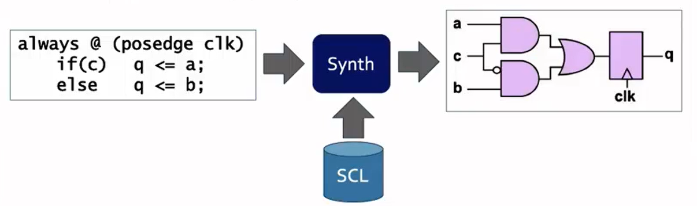

# SKY130_D1_SK2 - SoC design and OpenLane

 

###  Introduction to all components of open-source digital asic design

To design an ASIC, we mainly require three parts
- RTL Designs
- EDA Tools
- PDK Data

  

- `RTL IPs` : Pre-designed building blocks written in a special language called Hardware Description Language (HDL). They describe how the circuit operates at a functional level.
- `EDA Tools`: (Electronic Design Automation Tools): Software programs used to automate various stages of designing and verifying electronic circuits. Popular EDA tools include Yosys, OpenSTA, OpenROAD etc...
- `PDK Data` (Process Design Kit Data): Collection of files provided by a foundry that specifies the rules and limitations of their manufacturing process.Some of the key things found in a PDK are
  - Process Design Rules: DRC, LVS, PEX, etc.
  - Device Models: SPICE, Verilog, etc.
  - Digital Standard Cell Libraries: LEF, Liberty, etc.
  - IO Libraries: LEF, Liberty, etc.
  - etc....

##### ASIC Design Flow

  

**`"Transforming RTL code into a Manufacturable GDSII file for chip fabrication."`**

`1. Synthesis`
  -  translates the Register-Transfer Level (RTL) description of a circuit into an equivalent representation using fundamental logic components.
  -   components are drawn from a pre-defined library called the Standard Cell Library (SCL).
  -   outcome of this process is a `Gate-level Netlist`.
  

  

Synthesis

  

Standard Cells layout

`2. Floor and Power Planning`
  - chip die is divided into different blocks for optimal placement.
  - Macro floorplanning : focuses on defining the size, pin locations, and organization (rows and routing tracks)

  

Chip and Floor Planning

  
  
Macro Floor Planning

  - multiple power and ground (VDD and VSS/GND) connections are made for proper operation.
  - Typically Power reaches all components through vertical channels and horizontal metal pathways. This parallel design helps minimize electrical resistance.
  - network utilizes the thicker upper metal layers of the chip for lower resistance.

  
  
Power Planning

`3. Placement`
  - Done in 2 steps: Global and Detailed
  - `Global` : intially optimal location for all the cells is decided, but some might overlay with each other also some might also not be legal
  - `Detailed` : positions from the Global placement are altered to become legal.

  
  
Macro Placement

  
  
Global and Detailed Placement

`4. Clock Tree Synthesis`
  - Before routing, we need to route the clock by creating the clock distribution network that delivers clock to all the sequential blocks
  -  follows shape such as H-tree, X-tree, etc.

  
  
Clock Tree Synthesis

`5. Routing`
  - Routing software uses metal layers from the chip's design rules (PDK).
  - A grid-based approach with `divide-and-conquer` strategy is used to manage the routing complexity.
  - Routing happens in two stages: global (coarse) for initial paths and detailed (fine) for defining exact wire paths.
  

  
  
Routing

`6. Sign OFF`
  - Once Routing is done, the final layout goes for verification
    - Physical Verification:
      - `Design Rule Checking (DRC)` : ensures the layout follows all the manufacturing guidelines set by the design rules (PDK)
      - `Layout vs Schematic (LVS)` : verifies that the final layout precisely matches the original circuit design captured in the schematic
    - Timing Verification:
      - `Static Timing Analysis` : ensure the circuit operates at the desired speed by meeting all timing constraints.
  
#####  Introduction to OpenLane 
- `OpenLane`
  - ***Main goal is to produce a clean GDSII with no human intervention (no-human-in-the-loop).***
  - i.e. No LVS violations, No DRC violations

  - Two modes of operation:
    - Autonomous: In this mode, we provide the design input and the software generates the entire layout in one go.
    - Interactive: allows for step-by-step execution. Can view the intermediate results after each step, giving more control over the process.
  
It also has large number of design examples. Currently, 43 designs are available with their best configurations.

#####  Introduction to OpenLane detailed ASIC design flow

  
  
OpenLane ASIC Design Flow

