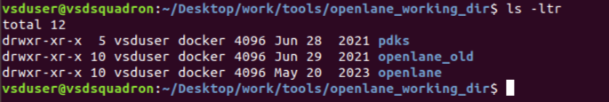
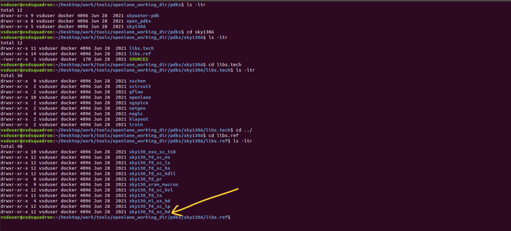
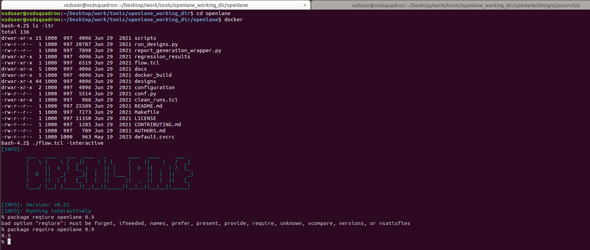
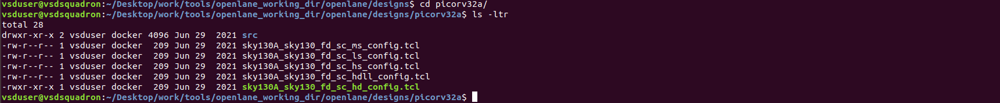
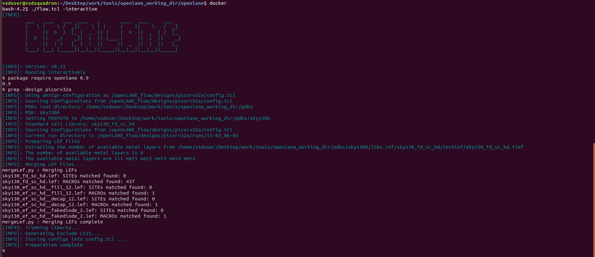
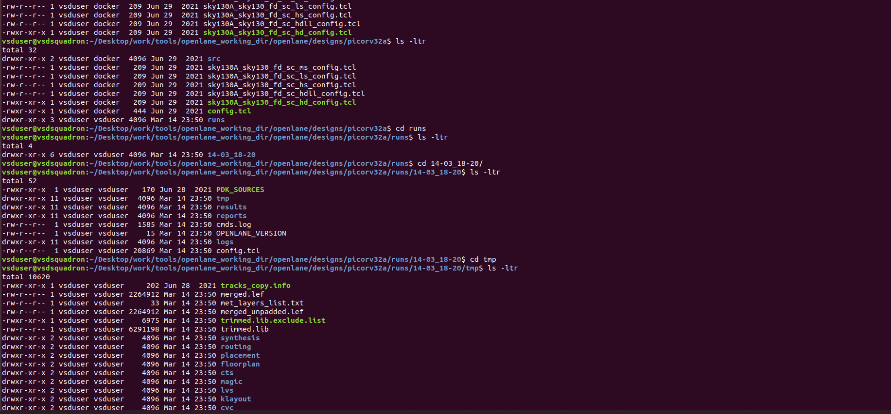

# Get familiar to open-source EDA tools

- The Open Lane Directory has the following folders
<p align="center">
  
</p>

- we will be working in the openlane directory and PDKs directory as the name suggests contains all the PDK files
<p align="center">
  
</p>

- these folders are in sky130A directory: (a) `libs.ref` and (b) `libs.tech`
	- libs.ref contains all the process or technology specific files
	- In this workshop, we are working on the **`sky130_fd_sc_hd`** files which states for **`Sky130 foundry std. cell. high definition `**


##### Design Preparation

- OpenLane can be invoked using docker command using the interactive session.

<p align="center">
  
</p>

- As shown in image `./flow.tcl -interactive` runs the openlane in interactive mode.
- And `package require openlane 0.9` has to be run

OpenLane has multiple design files and we are  working on `picorv32a design`

<p align="center">
  
</p>

- Next We will setup the design stage for the flow and to begin with synthesis of a design:
  `prep -design picorv32a`
<p align="center">
  
</p>

- This creates the new directory named `runs` under picorv32a folder that consists of folder with name as datetime when the above command is run. It consists of results, reports, command logs, etc. as shown below.

<p align="center">
  
</p>

Run synthesis with the command:
`run_synthesis`

- After the synthesis step is complete, reports and results are generated.

Output stats after the synthesis are as follows:
```shell
28.  Printing statistics.

=== picorv32a ===

   Number of wires:              14596
   Number of wire bits:          14978
   Number of public wires:        1565
   Number of public wire bits:    1947
   Number of memories:               0
   Number of memory bits:            0
   Number of processes:              0
   Number of cells:              14876
     sky130_fd_sc_hd__a2111o_2       1
     sky130_fd_sc_hd__a211o_2       35
     sky130_fd_sc_hd__a211oi_2      60
     sky130_fd_sc_hd__a21bo_2      149
     sky130_fd_sc_hd__a21boi_2       8
     sky130_fd_sc_hd__a21o_2        57
     sky130_fd_sc_hd__a21oi_2      244
     sky130_fd_sc_hd__a221o_2       86
     sky130_fd_sc_hd__a22o_2      1013
     sky130_fd_sc_hd__a2bb2o_2    1748
     sky130_fd_sc_hd__a2bb2oi_2     81
     sky130_fd_sc_hd__a311o_2        2
     sky130_fd_sc_hd__a31o_2        49
     sky130_fd_sc_hd__a31oi_2        7
     sky130_fd_sc_hd__a32o_2        46
     sky130_fd_sc_hd__a41o_2         1
     sky130_fd_sc_hd__and2_2       157
     sky130_fd_sc_hd__and3_2        58
     sky130_fd_sc_hd__and4_2       345
     sky130_fd_sc_hd__and4b_2        1
     sky130_fd_sc_hd__buf_1       1656
     sky130_fd_sc_hd__buf_2          8
     sky130_fd_sc_hd__conb_1        42
     sky130_fd_sc_hd__dfxtp_2     1613
     sky130_fd_sc_hd__inv_2       1615
     sky130_fd_sc_hd__mux2_1      1224
     sky130_fd_sc_hd__mux2_2         2
     sky130_fd_sc_hd__mux4_1       221
     sky130_fd_sc_hd__nand2_2       78
     sky130_fd_sc_hd__nor2_2       524
     sky130_fd_sc_hd__nor2b_2        1
     sky130_fd_sc_hd__nor3_2        42
     sky130_fd_sc_hd__nor4_2         1
     sky130_fd_sc_hd__o2111a_2       2
     sky130_fd_sc_hd__o211a_2       69
     sky130_fd_sc_hd__o211ai_2       6
     sky130_fd_sc_hd__o21a_2        54
     sky130_fd_sc_hd__o21ai_2      141
     sky130_fd_sc_hd__o21ba_2      209
     sky130_fd_sc_hd__o21bai_2       1
     sky130_fd_sc_hd__o221a_2      204
     sky130_fd_sc_hd__o221ai_2       7
     sky130_fd_sc_hd__o22a_2      1312
     sky130_fd_sc_hd__o22ai_2       59
     sky130_fd_sc_hd__o2bb2a_2     119
     sky130_fd_sc_hd__o2bb2ai_2     92
     sky130_fd_sc_hd__o311a_2        8
     sky130_fd_sc_hd__o31a_2        19
     sky130_fd_sc_hd__o31ai_2        1
     sky130_fd_sc_hd__o32a_2       109
     sky130_fd_sc_hd__o41a_2         2
     sky130_fd_sc_hd__or2_2       1088
     sky130_fd_sc_hd__or2b_2        25
     sky130_fd_sc_hd__or3_2         68
     sky130_fd_sc_hd__or3b_2         5
     sky130_fd_sc_hd__or4_2         93
     sky130_fd_sc_hd__or4b_2         6
     sky130_fd_sc_hd__or4bb_2        2

   Chip area for module '\picorv32a': 147712.918400
 

```

Here the DFF count:  `sky130_fd_sc_hd__dfxtp_2` = `1613`

- And total number of cells = `14876`

    ```
  D flip-flop ratio  = count of DFFs / total number of cells
  		     = 1613 / 14876
  		     = 0.108429685 (OR) 10.8429 %
    ``` 
