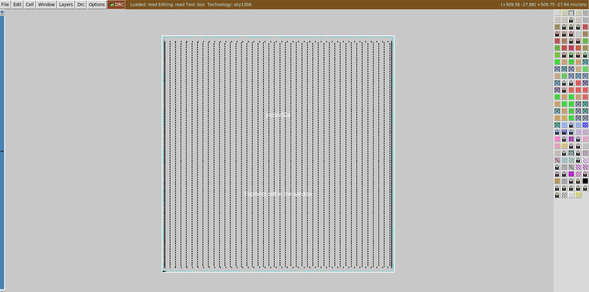

# Chip Floor planning considerations

#### Floorplan Stage:

1. **Decide the Utlization factor and Aspect ratio**
   ``` shell
   Utilisation Factor =  Area occupied by netlist
                        --------------------------
                           Total area of core
   Aspect Ratio = Height
                 --------
                  width
   ```  
   If the Utilization factor is 1, it means that 100% area of core has been occupied by the netlist only leaving no more space for any components(buffers etc...)
   In practical conditions, utilization factor is about 0.5 - 0.6. This means that 50% space is occupied by netlist and the remaining space is available for routing and any other additional cells.
2. **Fix the location of pre-placed cells**
   The placement of the pre-placed cells on the core is user-defined and must be done before placement and routing. Preplaced cells must be precisely defined, as automated placement tools won't modify them.
3. **Adding Decoupling Capactiors**
   Surround preplaced cells with decoupling capacitors. The preplaced cells requires a high amount of current from the powersource for current switching. But since there will be a distance between the main powersource and the cell, there will be voltage drop due to the resistance and inductance of the wire. This might cause the voltage at the logicblock to be not within the noise margin range anymore (logic is unstable). The solution is to use decoupling capacitors near the logic block, this capacitor will send enough current needed by the logicblock to switch within the noise margin range.
4. **Power Rails**
    Placing decoupling capacitors everywhere is impractical. Instead, they're strategically placed near critical preplaced logic blocks. Because when large numbers of elements switching simultaneously can cause voltage dips (during logic 1 transitions) or ground bounce (during logic 0 transitions), pushing voltages outside the noise margin. And thereby chips use a power mesh with `multiple power and ground pins`. This allows each element to get current from the nearest VDD and sink the current to the nearest VSS, ensuring stable voltage levels.
5. **Placement of Pins**
   Input and Output pins are placed on the space between the core and the die. The placement of the pins depends on where the cells connected to those pins are placed on the core.
6. **Logical Cell Placement Blockage**
   In this step, the area where pins were not place is blocked as shown in figure so as to ensure that the automated placement and routing tool does not place any cell here.
<p align="center">
  
</p>

<p align="center">
  
</p>

#### LAB (Floor Plan in OpenLANE)

- So first we need to set the configuration variables or switches. And these variables are present in `openlane/configuration`
<p align="center">
  
</p>

- The `README.md` describes all configuration variables for every stage and the tcl files contain the default OpenLANE settings.
- And while running floorplan, configuration varibales can also be set in two other files which are in `picorv32a` directory.(`config.tcl` and `sky130A_sky130_fd_sc_hd_config.tcl`)
- The priority order for these are (in increasing order)
  - `floorplan.tcl`
  - `config.tcl`
  - `sky130A_sky130_fd_sc_hd_config.tcl`

<p align="center">
  
</p>
<p align="center">
  
</p>
<p align="center">
  
</p>

- to run picorv32a Floorplan in OpenLANE use the command `% run floor_plan`
- After running the floorplan output files are generated in this folder `openlane/designs/picorv32a/runs/date/results/floorplan/picorv32a.floorplan.def` which is a `design exchange format`, containing the die area and positions.
<p align="center">
  
</p>

- the **`die area`** can be calculated as
  ```shell
  DIEAREA (0 0) (554570 565290)
  And unit distance = 1000 microns

  area of die = (554570/1000) microns * (565290/1000) microns = 311829.1653 microns^2
  ```
More about `.def` file can be read here 👉[Design Exchange Format (DEF)](https://ivlsi.com/design-exchange-format-def-in-vlsi-physical-design/) and also docs page [DEF 5.8 Language Reference](https://coriolis.lip6.fr/doc/lefdef/lefdefref/LEFSyntax.html)


- the `def` file can be opened the `magic` using the commannd
```shell
magic -T /home/vsduser/Desktop/work/tools/openlane_working_dir/pdks/sky130A/libs.tech/magic/sky130A.tech lef read ../../tmp/merged.lef def read picorv32a.floorplan.def &
```

<p align="center">
  
</p>

- Here, equidistant input pins (FP_IO_MODE = 1) can be seen: 
<p align="center">
  
</p>

- The components in the layout can be identified by using the `what` command in tkcon window after making a selection of the component:
<p align="center">
  
</p>
<p align="center">
  
</p>
<p align="center">
  
</p>
<p align="center">
  
</p>

- Standard Cells can be viewed at the bottom left corner of the layout
<p align="center">
  
</p>


- The configuration paramters which got run during in floorplan are in the `run\date` directory
```shell
PDK_SOURCES
results
reports
OPENLANE_VERSION
logs
tmp
cmds.log
config.tcl
```
- the `config.tcl` contains the parameters

<p align="center">
  
</p>

- In the above image as shown, the default parameters `FP_IO_VMETAL` and `FP_IO_HMETAL` in the `floorplan.tcl` were overriden by the parameters in the `config.tcl` file
- Also the `FP_CORE_UTIL` default value is `50` and in the `config.tcl` it's value was set to `65`, but in the output `config.tcl` the value was `50` because in the `sky130A_sky130_fd_sc_hd_config.tcl` it's value was to `50` and thereby because of the higher priority of this `50` will be the core utilization.

- Suppose if and erros occur, the logs can be viewed in `openlane/designs/picorv32a/runs/date/logs/floorplan/` 
<p align="center">
  
</p>

- This is the `ioPlacer.log` file
<p align="center">
  
</p>
