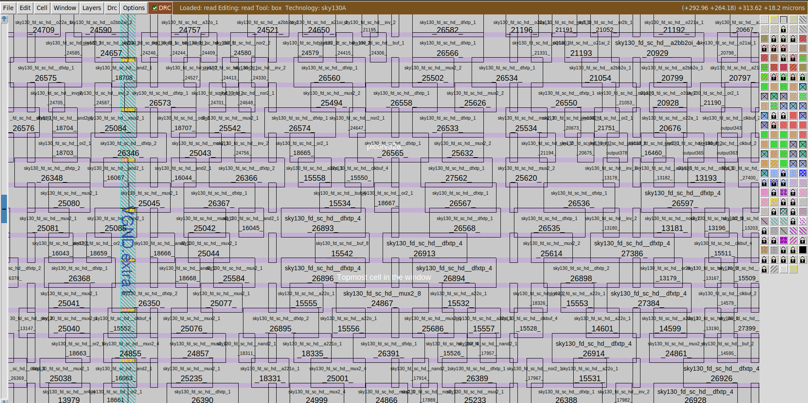

# Library Binding and Placement

### Placement Stage
Placement is done on two stages:

- `Global Placement` : this placement is with no legalizations . It uses Half Perimeter Wirelength (HPWL) reduction model.
- `Detailed Placement` : this placement is with legalization where the standard cells are placed on stadard rows, and there will be no overlaps of the cells

  

#### LAB to run Placement in OpenLANE

-  to run placement use the commmand `run_placement` 
- this command includes and does global placement (by `RePlAce tool`) and the detailed placement is done (by `OpenDP, or Open-Source Detailed Placement Engine.`)
- The objective of placement is the `convergence of overflow value`. If overflow value progressively reduces during the placement run it implies that the design will converge and placement will be successful.

  

- After running the placement output files are generated in this folder `/openlane/designs/picorv32a/runs/date/results/placement/picorv32a.placement.def` which is a `design exchange format`

  

- Zoomed in view of the layout 👇

  

