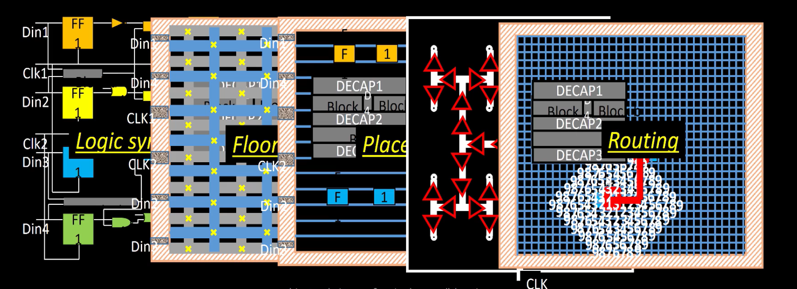
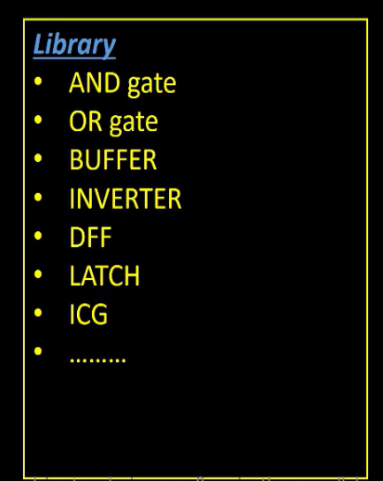
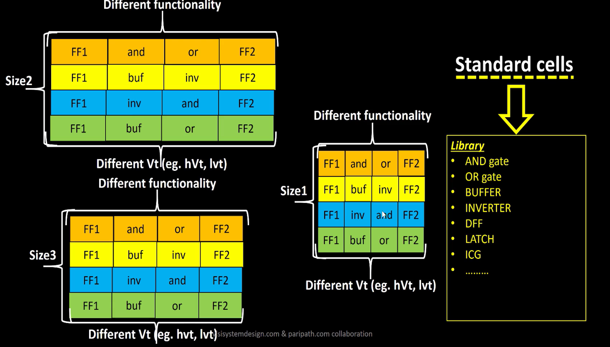
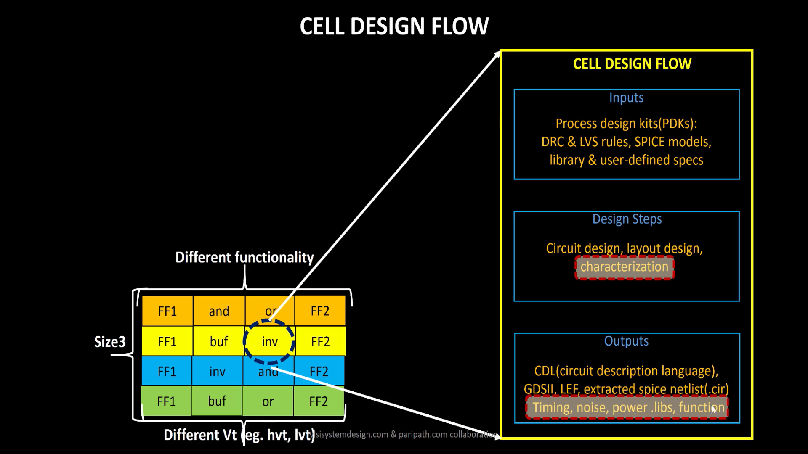
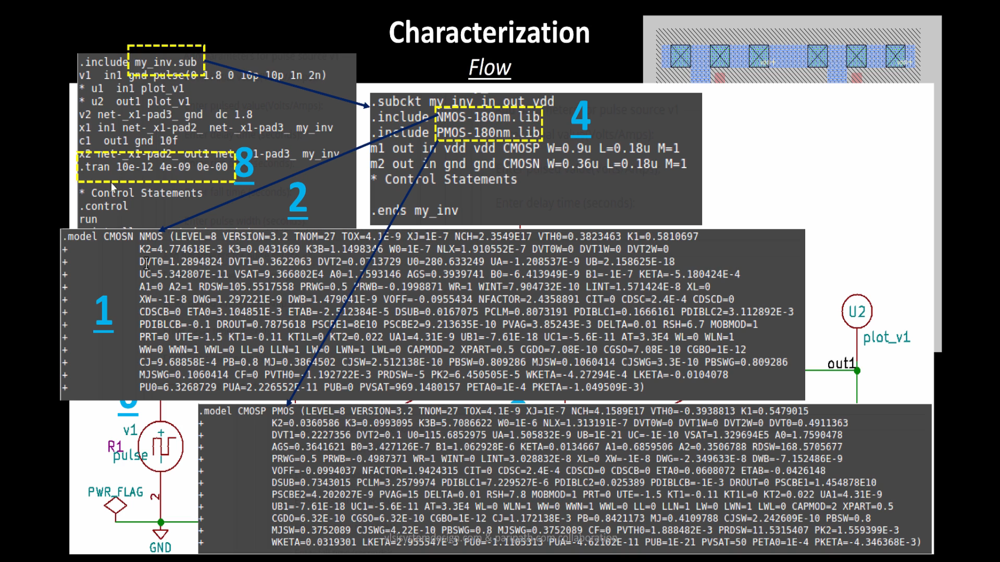
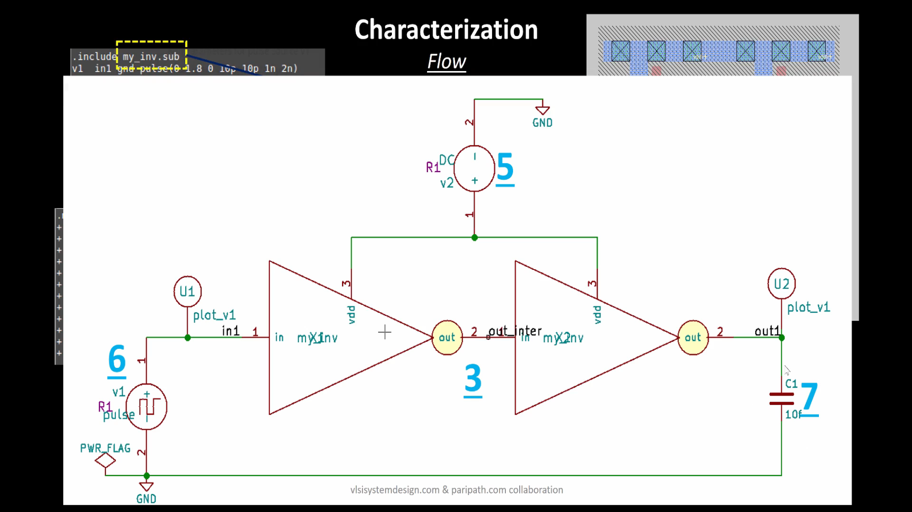
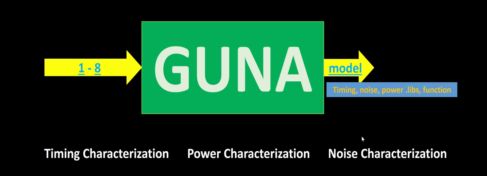

#  Cell Design and characterization flows

  

- In the each of the step of the flow from RTL to GDSII, the common thing is each step is `cells` or `gates`

  

#### So How do we Model or Characterize these cells or gates?

  

- The standard Cells as shown in the diagram, the same cell can have different size, different functionality, different Vt (threshold voltage) etc..
- And the cells are desinged usnig the following cell design flow
  

  

  <b>CELL DESIGN FLOW</b>

  

  <b>Inputs for cell design flow(DRC & LVS rules, SPICE models, library & User defined specs)</b>

  

  <b>Design Steps(Ciruit and Layout design)</b>

## Characterization Flow

1. Read in the Model Files (PMOS, NMOS etc..)
2. Read the extracted spce netlist
3. Recognise the Behavior of the buffers
4. Read the sub-circuits of inverter
5. Attach necessary power sources
6. Apply the stimulus(input)
7. provide output necessary capacitances
8. provide necessary simaultion command ( like transient or dc analysis)

  

  

  

- From 1-8 steps in the form of configuration file is fed to characterization software **`GUNA`**.
This software will generate Timing, noise and power models.

- We obtain Timing, Noise, Power.libs, Function from the GUNA software 
