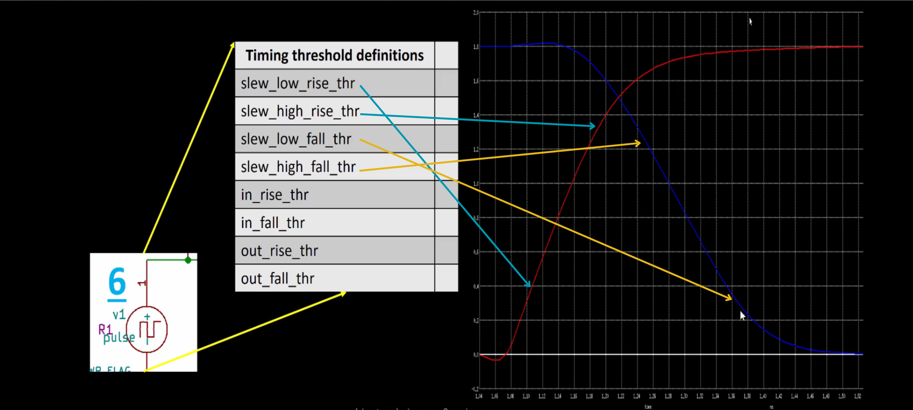
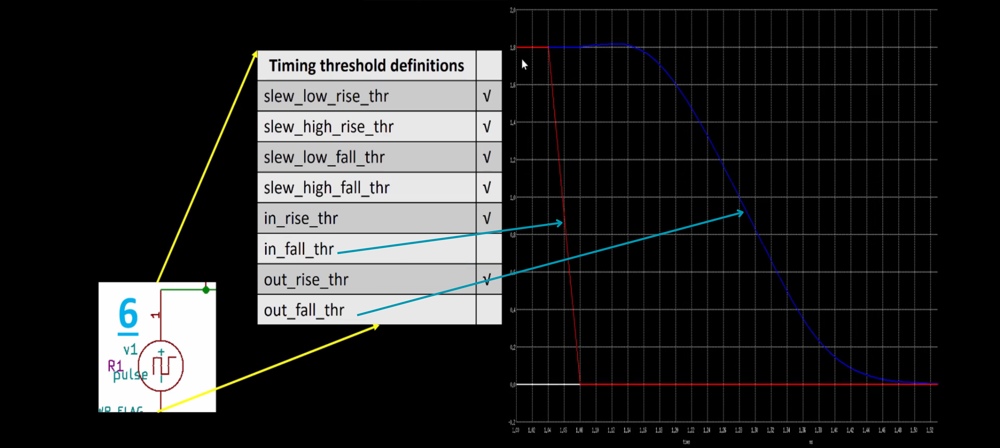
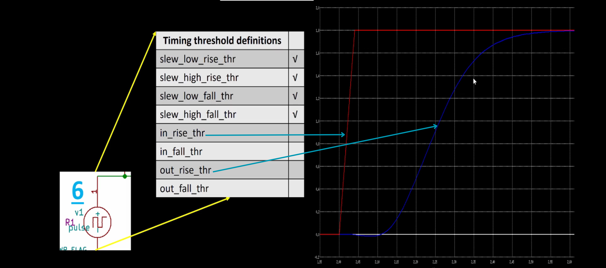
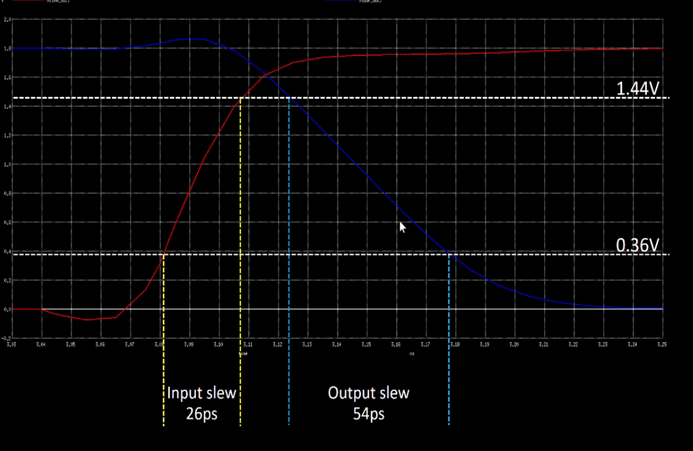

#  General Timing characterization parameters


```shell

Timing Parameter Definitions

Timing defintion	        Value
slew_low_rise_thr	20% value of max value
slew_high_rise_thr	80% value of max value
slew_low_fall_thr	20% value of max value
slew_high_fall_thr	80% value of max value
in_rise_thr	        50% value of max value
in_fall_thr	        50% value of max value 
out_rise_thr	        50% value of max value
out_fall_thr	        50% value of max value
```
- This is graph for two inverters in series, red is output of first inverter and blue is output of second inverter. and the paramters are showm 
<p align="center">
  
</p>

- Below are the images for timing variables for propagation delay. The red is input and blue is output of the buffer.
<p align="center">
  
</p>
<p align="center">
  <b>Rise Delay graph</b>
</p>
<p align="center">
  
</p>
<p align="center">
  <b>Fall Delay graph</b>
</p>

``` 
Rise delay =  time(out_rise_thr) - time(in_rise_thr)

Fall Delay = time(out_fall_thr) - time(in_fall_thr)

Rise transition time: time(slew_high_rise_thr) - time(slew_low_rise_thr)

Fall transition time: time(slew_high_fall_thr) - time(slew_low_fall_thr)
```

<p align="center">
  
</p>