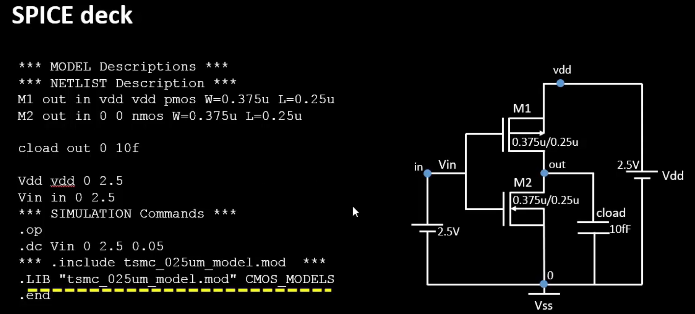
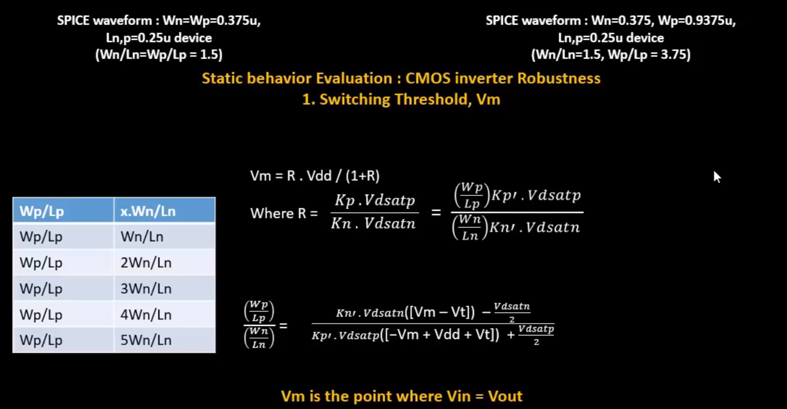

# Design library cell using Magic Layout and ngspice characterization

## Labs for CMOS inverter ngspice simulations

- One advantage of OpenLANE is its ability to dynamically modify internal switches (parameters) within the ASIC design flow. This allows us to explore different floorplanning and placement options without needing to restart the tool from scratch.

##### SPICE deck creation for CMOS inverter

A SPICE deck contains should contain following information:
- Model description
- Netlist description
- connectivtiy between components
- Component values
- Capacitance load
- Nodes
- Simulation type and parameters
- Libraries included
  

  

As shown in the above image (a typical spice deck)
- vdd, in, 0 are the nodes
- and M1, M2 pmos and nmos are defined (drain gate source substrate)
- load capacitance is added
- power rails and inputs are defined
- and the simualtion type (dc analysis is added)
- at last the libraries for the nmos and pmos were included

  

  

  

