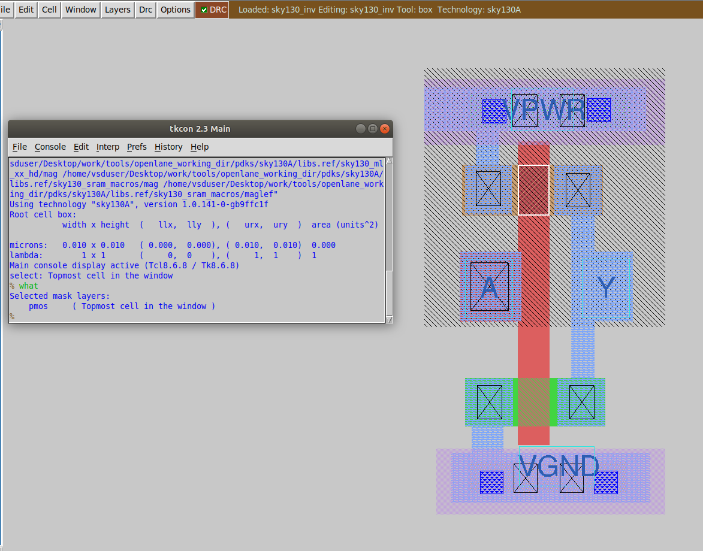
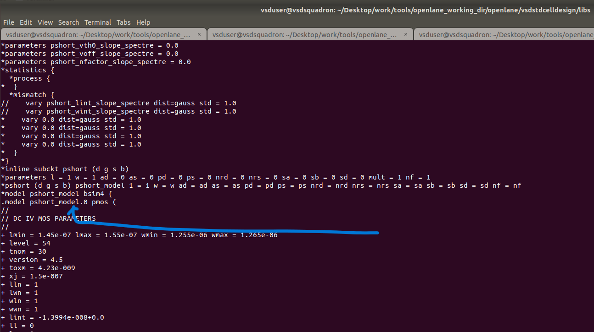
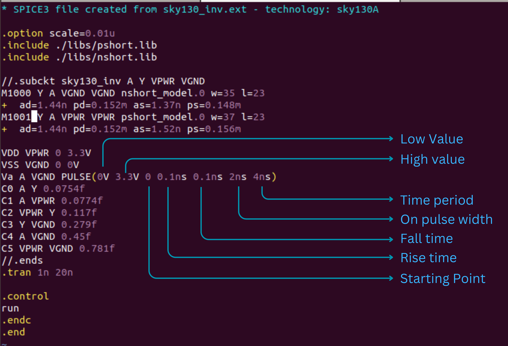
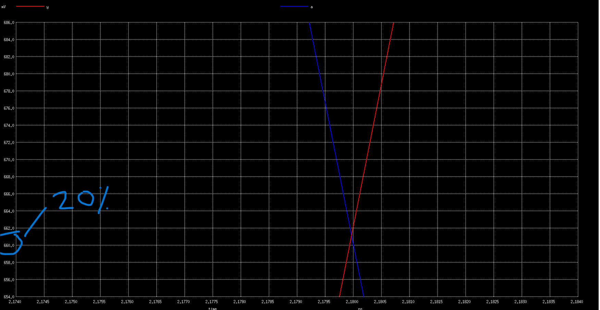
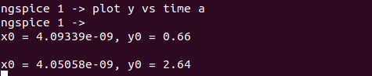
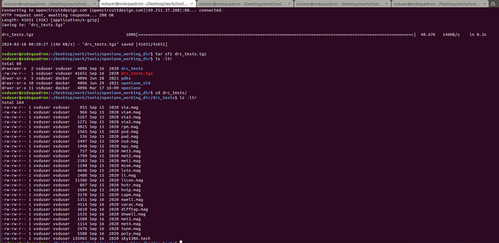

# LAB - Sky130 Tech File Labs

##### Steps to git clone vsdstdcelldesign

- to work in the futher labs clone(download) the below repository at the location `/Desktop/work/tools/openlane_working_dir/openlane`
```shell
git clone https://github.com/nickson-jose/vsdstdcelldesign.git
```
<p align="center">
  
</p>

- these are the files and folders are in the `vsdstdcelldesign` repo

- to open the `sky130_inv.mag` file in magic the command is
```shell
 magic -T sky130A.tech sky130_inv.mag
```
- the image below is an inverter layout
<p align="center">
  
</p>  

- the images below shows about different layers and interconnects in the inverter layout
<p align="center">
  
</p>  

<p align="center">
  
</p>  

<p align="center">
  
</p>  

<p align="center">
  
</p>  

<p align="center">
  
</p>  

<p align="center">
  
</p>  

##### Layout to Library Exchange Format (LEF) file

- to extract lef file from layout using the below commands in the `tkon` window 
```shell
extract all
ext2spice sky130_inv into sky130_inv.ext:
ext2spice
```
<p align="center">
  
</p>

- two files `sky130_inv.ext` and `sky130_inv.spice` are created
<p align="center">
  
</p>

- the `sky130_inv.ext` file is containing the following contents
<p align="center">
  
</p>

#####  steps to create final SPICE deck using Sky130 tech
- `sky130_inv.ext` file is modified 👇
- the `.option scale` is changed to `0.01u` as it is found by zooming into the layout and a single grid box size was found using `:box` command
<p align="center">
  
</p>

- in `pshort.lib` file pmos is defined as `pshort_model.0` so in the spice deck it will be defined like that so as to import correctly all the paramters from the lib file. similarly with nmos is also done `nshort_model.0`
<p align="center">
  
</p>

- the final spice deck is 
<p align="center">
  
</p>

- the library files required for the nmos and pmos were included
- nodes `VDD` and `VSS` were identified and the power supply and input pulse `Va` is defined
- and at last the simulation commands are set for transient analysis

Now run the spice simulation using ngpisce tool `ngspice sky130_inv.spice`

<p align="center">
  
</p>

- to plot the graph run command
<p align="center">
  
</p>
  
- after running a new window with a graph is opened
<p align="center">
  
</p>
  
- it can be observed that the output graph(in red colour) has little noise. and thereby by changing the load capactinace we can eliminate that.
<p align="center">
  
</p>

- After changing the capacitance value to `2f` in the spice deck, the graph is improved with reduced noise.
<p align="center">
  
</p>


- Now let's find out the rise transition time. For that we need `20%` and `80%` of the maximum or peak value. And peak value is approx. `3.3v`
- `20%` of peak value = `0.66v`
- `80%` of peak value = `2.64v`
- These values can be shown in the graph by zooming in. The x points can be found by clicking on the line where it meets `0.66` and `2.64` and the points will be shown in the terminal..
<p align="center">
  
</p>
<p align="center">

  
</p>
<p align="center">
  
</p>

- We got the x points. Therefore the rise transition time can be calculated as
```shell
Rise Transition time = time(slew_high_rise_thr) - time(slew_low_rise_thr)
                     = 2.239 - 2.180
                     = 0.059ns
```

- Similarly Rise Delay can be calcualted by taking `50%` of the maximum value
- `50%` of `(3.3)`peak value = `1.65v`
<p align="center">

  
</p>
<p align="center">
  
</p>

- Therefore the rise delay can be calculated as
```shell
Rise delay =  time(out_rise_thr) - time(in_rise_thr)
           = 2.207 - 2.150
           = 0.057ns
```

- Similarly Fall Transition time can be calculated 
<p align="center">
  
</p>

```shell
Fall transition time = time(slew_high_fall_thr) - time(slew_low_fall_thr)
                     = 4.093 - 4.050
                     = 0.0428ns
```

- And Fall delay can be calculated as
<p align="center">
  
</p>

```shell
Fall Delay = time(out_fall_thr) - time(in_fall_thr)
           = 4.075 - 4.050
           = 0.025ns
```


##### Introduction to Magic tool options and DRC rules

- to know more about technology files 👉 [Magic Technology File Format 35 Manual](http://opencircuitdesign.com/magic/techref/maint2.html)
- and the DRC rules for SKY130nm PDK can be read from here 👉[Rules](https://skywater-pdk.readthedocs.io/en/main/rules/periphery.html#rules-periphery--page-root)

- to download lab files use the commands
```shell
wget http://opencircuitdesign.com/open_pdks/archive/drc_tests.tgz
tar xfz drc_tests.tgz
```
<p align="center">
  
</p>

- here we have the `.mag` files and then `sky130A.tech` file
- to invoke magic use the command `magic -d XR`
- then open the `met3.mag` file in magic
<p align="center">
  
</p>
<p align="center">
  
</p>
<p align="center">
  
</p>
<p align="center">
  
</p>

- then after open `poly.mag` file to fix the errors in that file
<p align="center">
  
</p>
<p align="center">
  
</p>

<p align="center">
  
</p>
<p align="center">
  
</p>

- Make the above changes to the `sky130A.tech` file and save it and the again load it using `tech load sky130A.tech` and use the command `drc check` to check the `.mag` file for the drc errors with the modified `.tech` file 
<p align="center">
  
</p>
<p align="center">
  
</p>