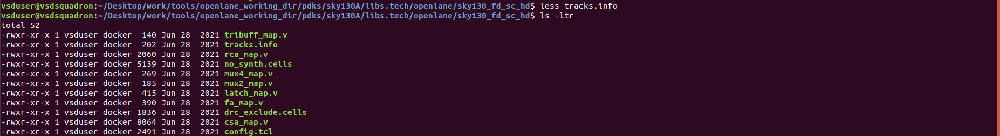

#  Pre-layout timing analysis and importance of good clock tree

## Timing modelling using delay tables


#### Lab steps to convert grid info to track info

- We only require `lef` file which contains the cell physical information, we don't require all the information in the `mag` file.
- So we have extract the `lef` file from the `mag` file.
- this is the inverter we have seen from the previous labs
<p align="center">
  
</p>

- There are some conditions that need to be satisified before we place standard cells into the pnr flow. 
  -  Input and output ports of the standard cell should lie on the intersection of the vertical and horizontal tracks.
  - Width of the standard cell should be odd multiples of the horizontal track pitch.
  - Height of the standard cell should be even multiples of the vertical track pitch. 
  
- in the below location we can find the `tracks.info` for `sky130_fd_sc_hd`
<p align="center">
  
</p>
<p align="center">
  
</p>

- Initially the grid size look like this as shown in the below image
<p align="center">
  
</p>

- now we resize the grid as per the dimensions in `track.info`

```shell
grid 0.46um 0.34um 0.23um 0.17um
```
<p align="center">
  
</p>


<p align="center">
  
</p>

- Here, the input and output ports (A and Y) are lying on the intersection of the vertical and horizontal pitch ✅
- Also,In the above image the `horizontal track pitch`  is  `0.46um` , therfore total `width of standard cell` = `3 x 0.46` = `1.38um`
- Hence width is odd multiple of horizontal track pitch. Verified..✅
<p align="center">
  
</p>

- In the above image the `vertical track pitch`  is  `0.34um` , therfore total `height of standard cell` = `8 x 0.34` = `2.72um`
- Hence height is even multiple of vertical track pitch. Verified..✅
  

- Now save the layout with command `save sky130_vsdinv.mag`
- and open the new layout file using magic command `magic -T sky130A.tech sky130_vsdinv.mag &`

<p align="center">
  
</p>

- this is new layout file. To generate `lef` file from this use `lef write` command in the tkcon window
<p align="center">
  
</p>

- this is the `lef` file which is extracted 👆
  
- Now since the `lef` file is there, it needs to be added to the openalane flow picorv32a
- So, copy the `lef` file and all the library files into the `src` directory of `picorv32a`

<p align="center">
  
</p>

- library files which needs to copied into the `src` directory
<p align="center">
  
</p>

- using the command `cp libs/sky130_fd_sc_hd__* ~/Desktop/work/tools/openlane_working_dir/openlane/designs/picorv32a/src/` and the `lef` file `cp sky130_vsdinv.lef ~/Desktop/work/tools/openlane_working_dir/openlane/designs/picorv32a/src/` which copies the lib and lef files into src directory, which is shown in the below image 👇
<p align="center">
  
</p>


- Now, add the path of lib files and lef file to `config.tcl` in `picorv32a` so that this new cell will be included in the openlane flow
```shell
set ::env(LIB_SYNTH) "$::env(OPENLANE_ROOT)/designs/picorv32a/src/sky130_fd_sc_hd__typical.lib"
set ::env(LIB_SLOWEST) "$::env(OPENLANE_ROOT)/designs/picorv32a/src/sky130_fd_sc_hd__slow.lib"
set ::env(LIB_FASTEST) "$::env(OPENLANE_ROOT)/designs/picorv32a/src/sky130_fd_sc_hd__fast.lib"
set ::env(LIB_TYPICAL) "$::env(OPENLANE_ROOT)/designs/picorv32a/src/sky130_fd_sc_hd__typical.lib"

set ::env(EXTRA_LEFS) [glob $::env(OPENLANE_ROOT)/designs/$::env(DESIGN_NAME)/src/*.lef]
```
<p align="center">
  
</p>

- Now everything is set, open the openlane flow by using `docker` command and the each one of the commands below
  
```
./flow.tcl -interactive
package require openlane 0.9
prep -design picorv32a -tag 16-03_17-49 -overwrite
set lefs [glob $::env(DESIGN_DIR)/src/*.lef]
add_lefs -src $lefs
run_synthesis
```
<p align="center">
  
</p>
<p align="center">
  
</p>

#### Delay tables

- To avoid large skew between endpoints of a clock tree:

    - Buffers on the same level must have same capacitive load to ensure same timing delay
    - Buffers on the same level must also be the same
<p align="center">
  
</p>
<p align="center">
  
</p><p align="center">
  
</p>
<p align="center">
  
</p>

**``skew is zero since delay for both clock path is x9'+y15``**


#### Steps to configure synthesis settings to fix slack

- view the synthesis paramters in `readme.md` and look for those which could affect the slack by changing it. 👇
<p align="center">
  
</p>

- Now the below commands one by one
```
prep -design picorv32a -tag 16-03_17-49 -overwrite
set lefs [glob $::env(DESIGN_DIR)/src/*.lef]
add_lefs -src $lefs

# display current value of variable SYNTH_STRATEGY
echo $::env(SYNTH_STRATEGY)

# setting new value for SYNTH_STRATEGY
set ::env(SYNTH_STRATEGY) "DELAY 0"

# display current value of variable SYNTH_BUFFERING
echo $::env(SYNTH_BUFFERING)

# display current value of variable SYNTH_SIZING
echo $::env(SYNTH_SIZING)

# setting new value for SYNTH_STRATEGY
set ::env(SYNTH_SIZING) 1

# Command to display current value of variable SYNTH_DRIVING_CELL
echo $::env(SYNTH_DRIVING_CELL)

run_synthesis
```
<p align="center">
  
</p>
<p align="center">
  
</p>


- Before the chip area, tns and wns are
```
Chip area for module '\picorv32a': 147712.918400

tns -711.59
wns -23.89
```

- After changing the parameters chip area (beacuse `SYNTH_SIZING` is set to 1) is increased and tns and wns are as follows 
```
Chip area for module '\picorv32a': 196832.528000

tns 0
wns 0
```

- To verify actually if the standard cell is included.. naviagte to the `tmp` folder and view the `merged.lef` file and search for `vsdinv` which tells the standard cell(inverter) is included...
<p align="center">
  
</p>
<p align="center">
  
</p>


- Now synthesis is completed, moving on to next stage, floorplanning. run floorplan using command `run_floorplan`
<p align="center">
  
</p>

- when floorplan is run we get an error as shown in the above image, so we going to the `/home/vsduser/Desktop/work/tools/openlane_working_dir/openlane/docs/source/OpenLANE_commands.md` in the we can see the openlane commands
<p align="center">
  
</p>

now run floorplan and placement using commands
```
init_floorplan
place_io
global_placement_or
detailed_placement
tap_decap_or
detailed_placement
```
<p align="center">
  
</p>
<p align="center">
  
</p>
<p align="center">
  
</p>
<p align="center">
  
</p>

- the placement is done, and the def file is viewed in magic using command
```
magic -T /home/vsduser/Desktop/work/tools/openlane_working_dir/pdks/sky130A/libs.tech/magic/sky130A.tech lef read ../../tmp/merged.lef def read picorv32a.placement.def &
```
<p align="center">
  
</p>
<p align="center">
  
</p>
<p align="center">
  
</p>

<p align="center">
  
</p>
<p align="center">
  
</p>


  

  
