# Timing analysis with ideal clocks using openSTA

<p align="center">
  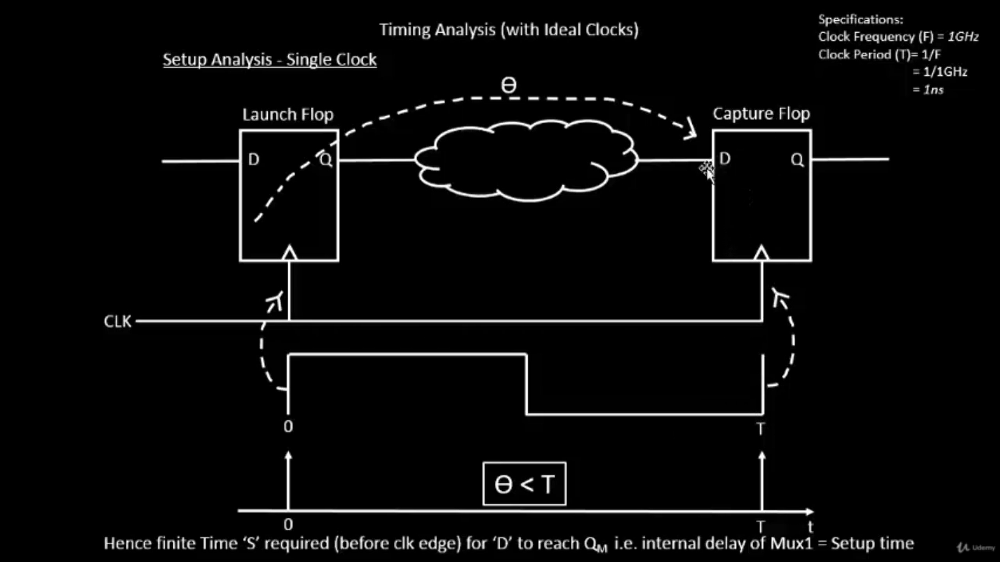
</p>
<p align="center">
  
</p>
<p align="center">
  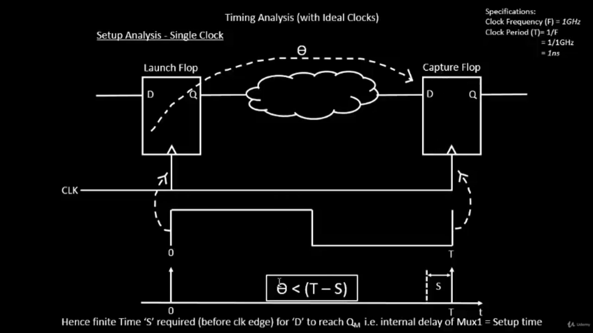
</p>
<p align="center">
  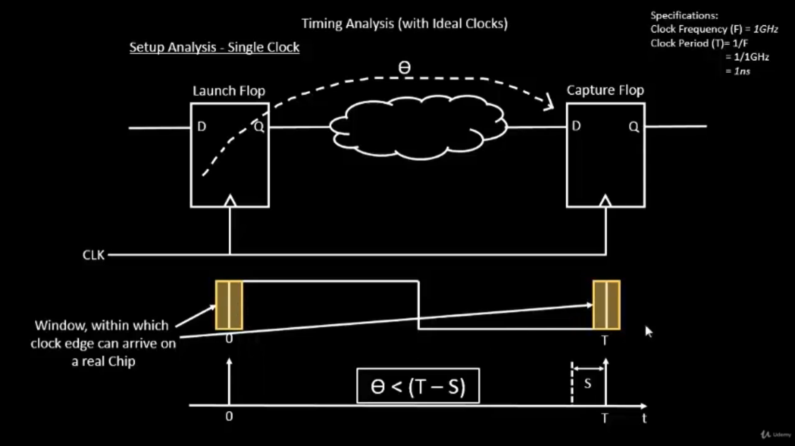
</p>
<p align="center">
  
</p>


### Lab Steps to configure OpenSTA for post-synth timing analysis

```
./flow.tcl -interactive
package require openlane 0.9
prep -design picorv32a -tag 16-03_17-49 -overwrite
set lefs [glob $::env(DESIGN_DIR)/src/*.lef]
add_lefs -src $lefs
set ::env(SYNTH_SIZING) 1
run_synthesis
```
- Before moving to post-synt complete the above steps...
- to perform post synthesis timing analysis, first we need to add files into our flow

-  in this location create a conf file `/home/vsduser/Desktop/work/tools/openlane_working_dir/openlane/pre_sta.conf` and add the contents as shown
<p align="center">
  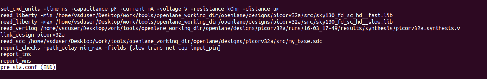
</p>

```
set_cmd_units -time ns -capacitance pF -current mA -voltage V -resistance kOhm -distance um
read_liberty -min /home/vsduser/Desktop/work/tools/openlane_working_dir/openlane/designs/picorv32a/src/sky130_fd_sc_hd__fast.lib
read_liberty -max /home/vsduser/Desktop/work/tools/openlane_working_dir/openlane/designs/picorv32a/src/sky130_fd_sc_hd__slow.lib
read_verilog /home/vsduser/Desktop/work/tools/openlane_working_dir/openlane/designs/picorv32a/runs/16-03_17-49/results/synthesis/picorv32a.synthesis.v
link_design picorv32a
read_sdc /home/vsduser/Desktop/work/tools/openlane_working_dir/openlane/designs/picorv32a/src/my_base.sdc
report_checks -path_delay min_max -fields {slew trans net cap input_pin}
report_tns
report_wns
```

- And in this location create a sdc file `/home/vsduser/Desktop/work/tools/openlane_working_dir/openlane/designs/picorv32a/src/my_base.sdc` and add the contents as shown
<p align="center">
  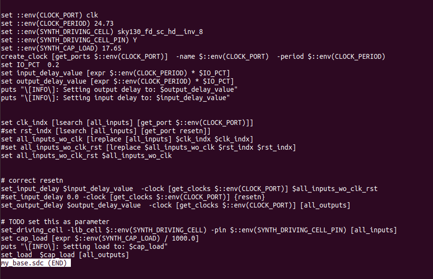
</p>

```
set ::env(CLOCK_PORT) clk
set ::env(CLOCK_PERIOD) 24.73
set ::env(SYNTH_DRIVING_CELL) sky130_fd_sc_hd__inv_8
set ::env(SYNTH_DRIVING_CELL_PIN) Y
set ::env(SYNTH_CAP_LOAD) 17.65
create_clock [get_ports $::env(CLOCK_PORT)]  -name $::env(CLOCK_PORT)  -period $::env(CLOCK_PERIOD)
set IO_PCT  0.2
set input_delay_value [expr $::env(CLOCK_PERIOD) * $IO_PCT]
set output_delay_value [expr $::env(CLOCK_PERIOD) * $IO_PCT]
puts "\[INFO\]: Setting output delay to: $output_delay_value"
puts "\[INFO\]: Setting input delay to: $input_delay_value"


set clk_indx [lsearch [all_inputs] [get_port $::env(CLOCK_PORT)]]
#set rst_indx [lsearch [all_inputs] [get_port resetn]]
set all_inputs_wo_clk [lreplace [all_inputs] $clk_indx $clk_indx]
#set all_inputs_wo_clk_rst [lreplace $all_inputs_wo_clk $rst_indx $rst_indx]
set all_inputs_wo_clk_rst $all_inputs_wo_clk


# correct resetn
set_input_delay $input_delay_value  -clock [get_clocks $::env(CLOCK_PORT)] $all_inputs_wo_clk_rst
#set_input_delay 0.0 -clock [get_clocks $::env(CLOCK_PORT)] {resetn}
set_output_delay $output_delay_value  -clock [get_clocks $::env(CLOCK_PORT)] [all_outputs]

# TODO set this as parameter
set_driving_cell -lib_cell $::env(SYNTH_DRIVING_CELL) -pin $::env(SYNTH_DRIVING_CELL_PIN) [all_inputs]
set cap_load [expr $::env(SYNTH_CAP_LOAD) / 1000.0]
puts "\[INFO\]: Setting load to: $cap_load"
set_load  $cap_load [all_outputs]
```

- After this go to openlane directory and for the post-synth analysis use command `sta pre_sta.conf` on the file
<p align="center">
  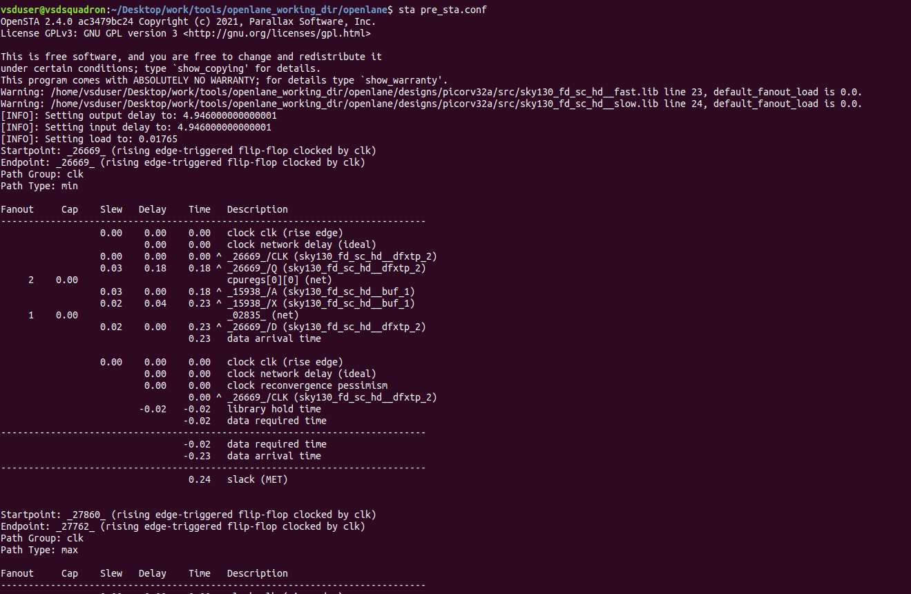
</p> 
<p align="center">
  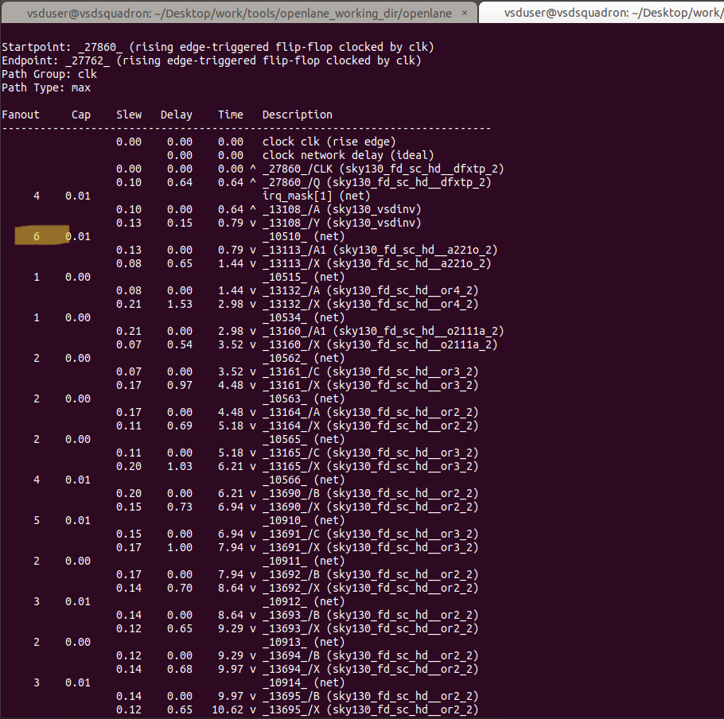
</p> 
<p align="center">
  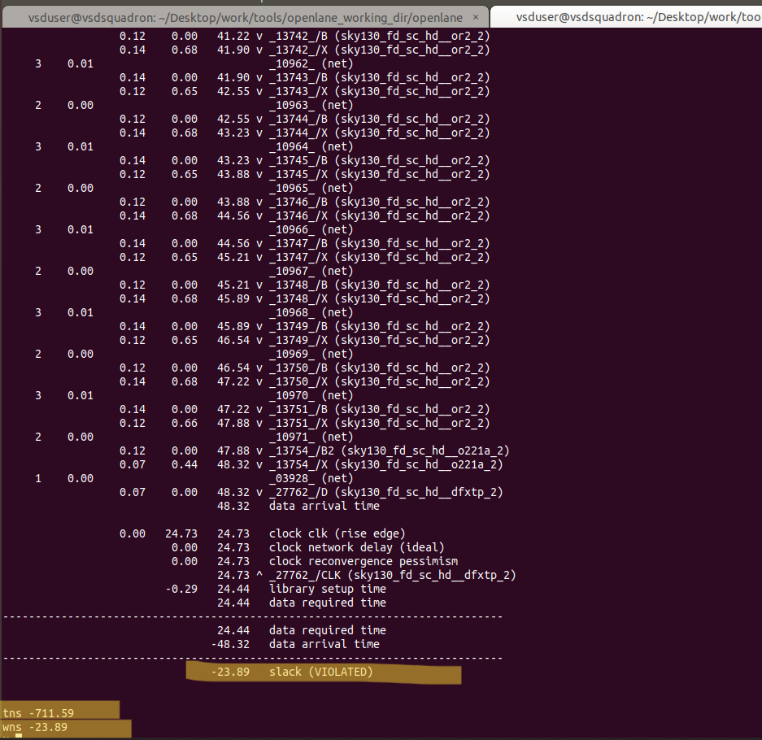
</p>


- Changing the `MAX_FANOUT` value to `4` and running again

```
./flow.tcl -interactive
package require openlane 0.9
prep -design picorv32a -tag 16-03_17-49 -overwrite
set lefs [glob $::env(DESIGN_DIR)/src/*.lef]
add_lefs -src $lefs
set ::env(SYNTH_SIZING) 1
set ::env(SYNTH_MAX_FANOUT) 4
run_synthesis
```

</p> 
<p align="center">
  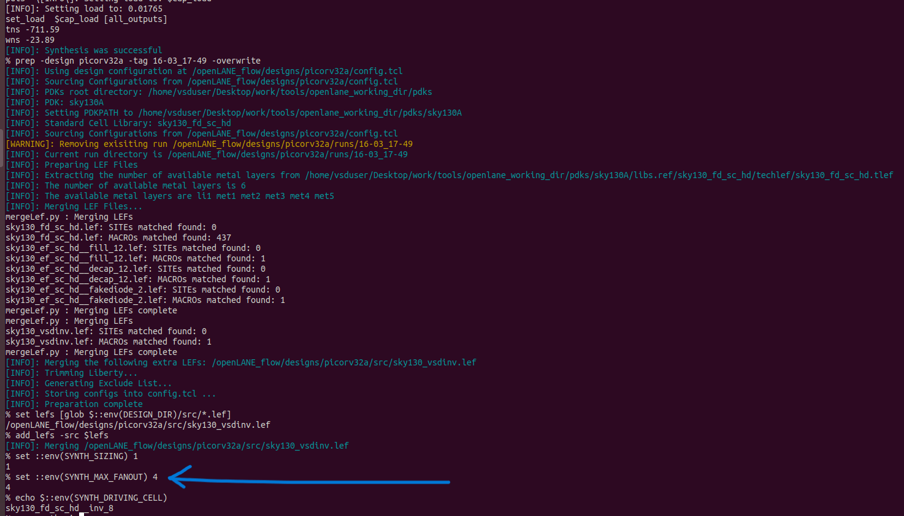
</p> 
<p align="center">
  
</p>

</p> 
<p align="center">
  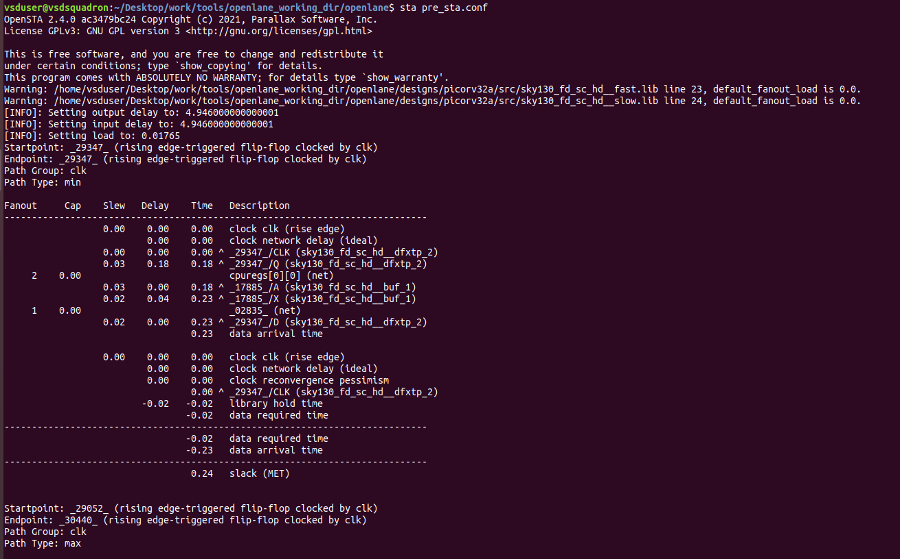
</p> 
<p align="center">
  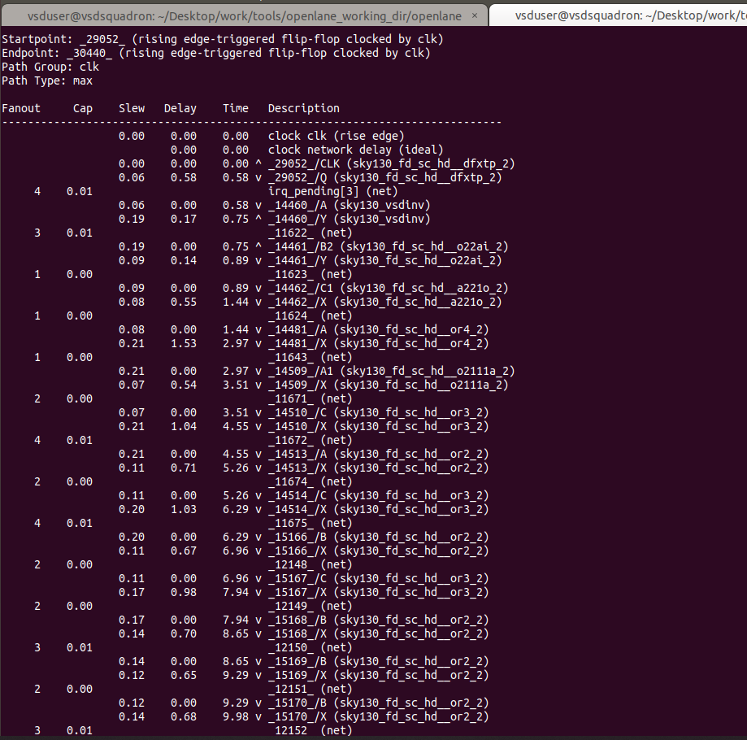
</p>
<p align="center">
  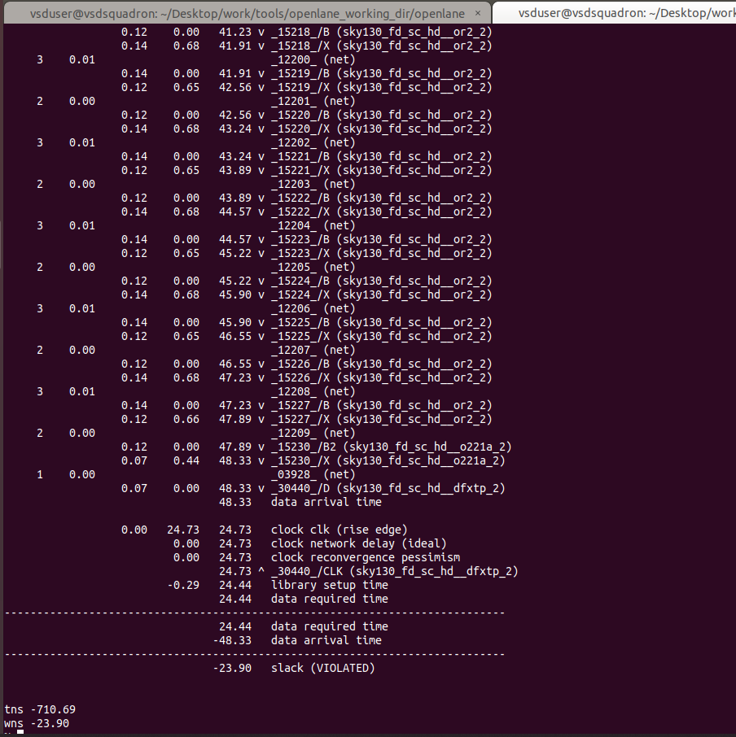
</p>

