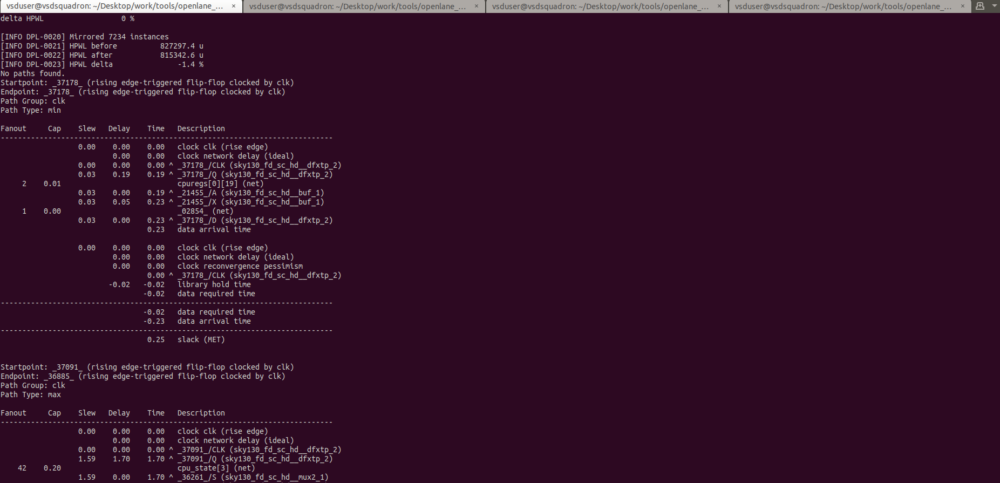
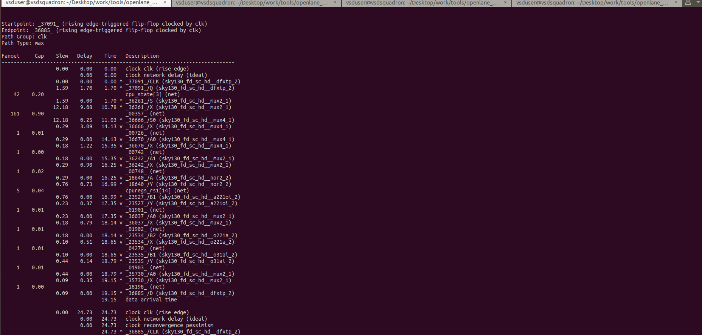
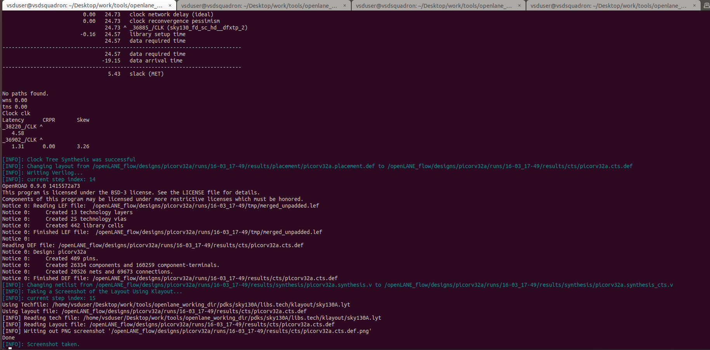
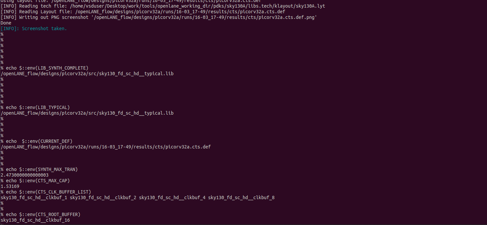
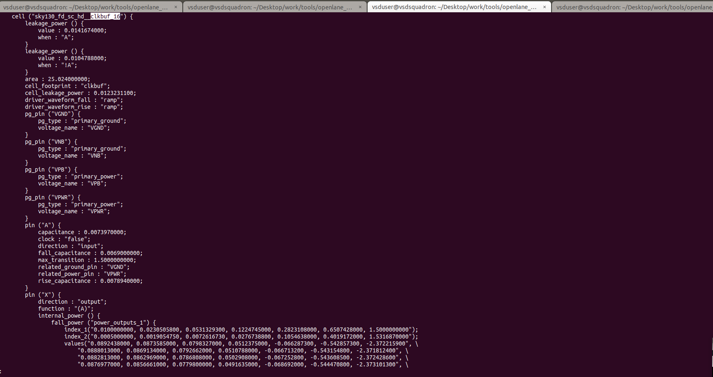
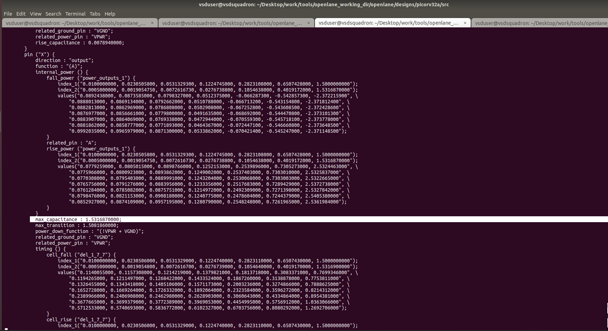

# Clock tree synthesis TritonCTS and signal integrity

<p align="center">
  
</p>

<p align="center">
  
</p>

- So we go for `H-Tree` method
<p align="center">
  
</p>

<p align="center">
  
</p>

- After adding buffers 👇
<p align="center">
  
</p>

### Clock Net Shielding 👇

<p align="center">
  
</p>
<p align="center">
  
</p>

- therefore the clock net is shieled 
<p align="center">
  
</p>

### Lab Steps to run CTS using TritonCTS

- from the previous labs, run until the placement stage using the commands

```shell
prep -design picorv32a -tag 16-03_17-49 -overwrite
set lefs [glob $::env(DESIGN_DIR)/src/*.lef]
add_lefs -src $lefs

set ::env(SYNTH_STRATEGY) "DELAY 0"
set ::env(SYNTH_SIZING) 1

run_synthesis

init_floorplan
place_io
global_placement_or
detailed_placement
tap_decap_or
detailed_placement
```

- After placement is done, we move on to the CTS stage and we run it using the command `run_cts` which use `TritonCTS` in `OpenROAD`
- The output after CTS stage is 👇
<p align="center">
  
</p>
<p align="center">
  
</p>
<p align="center">
  
</p>

- Verifying if CTS is run properly or not
<p align="center">
  
</p>

<p align="center">
  
</p>
<p align="center">
  
</p>
