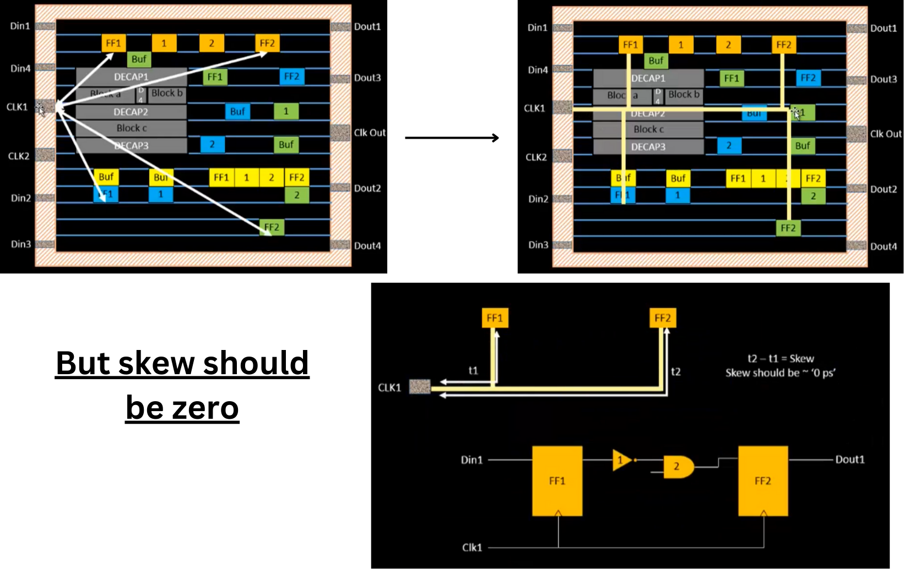
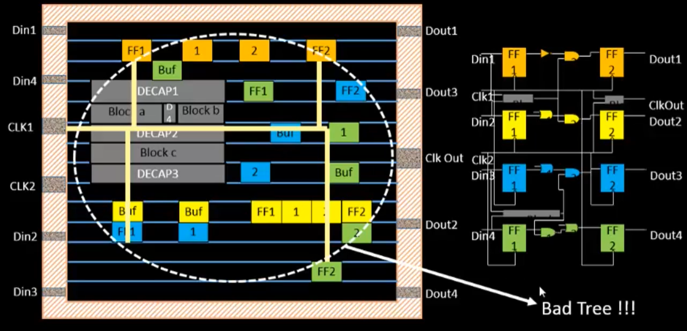
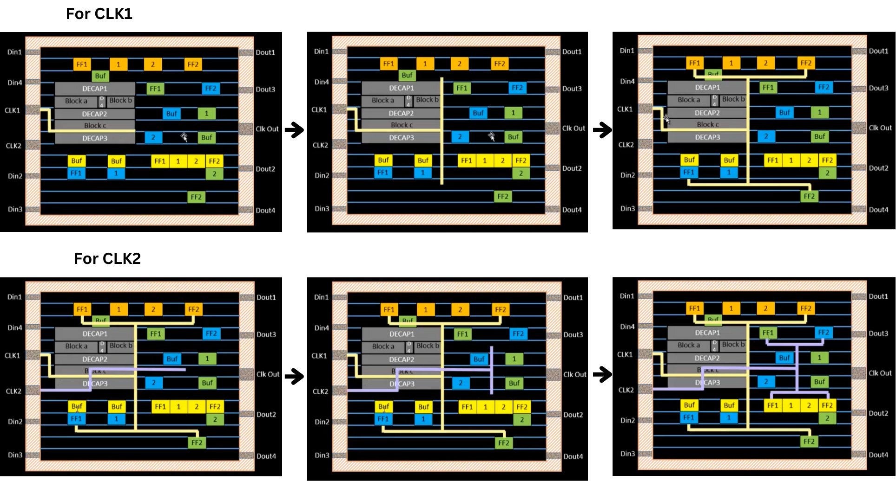
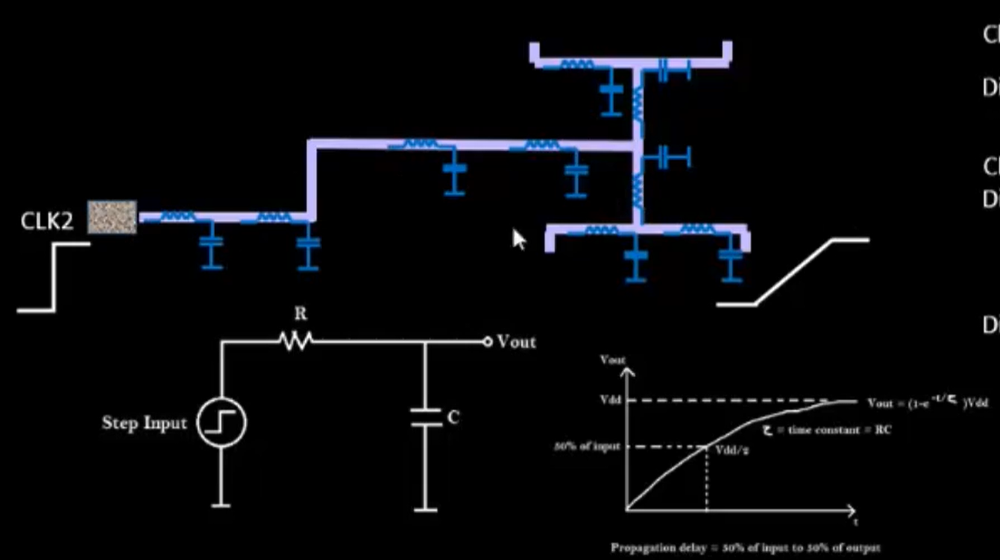
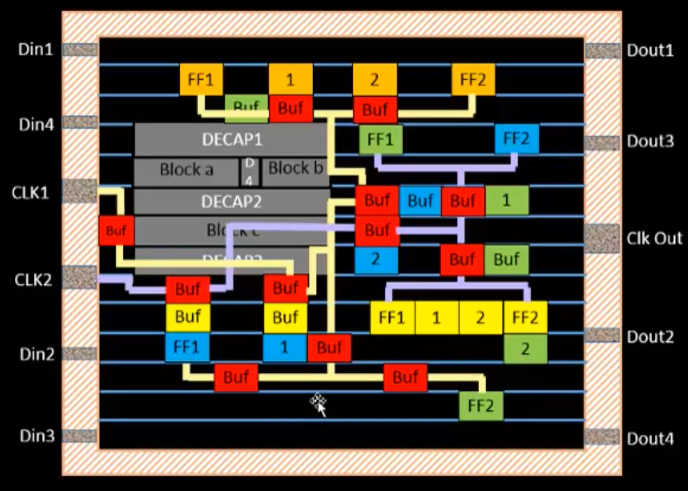
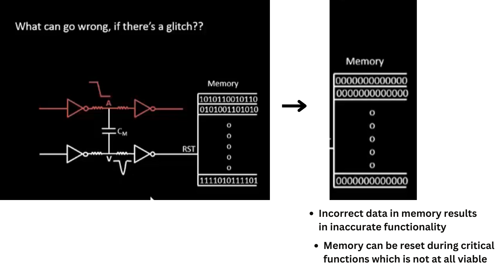
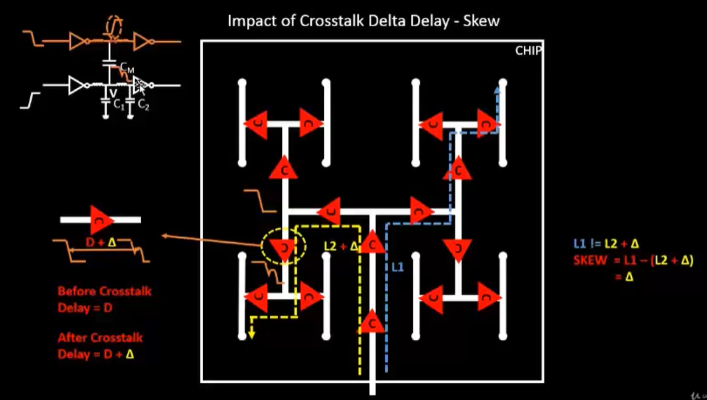
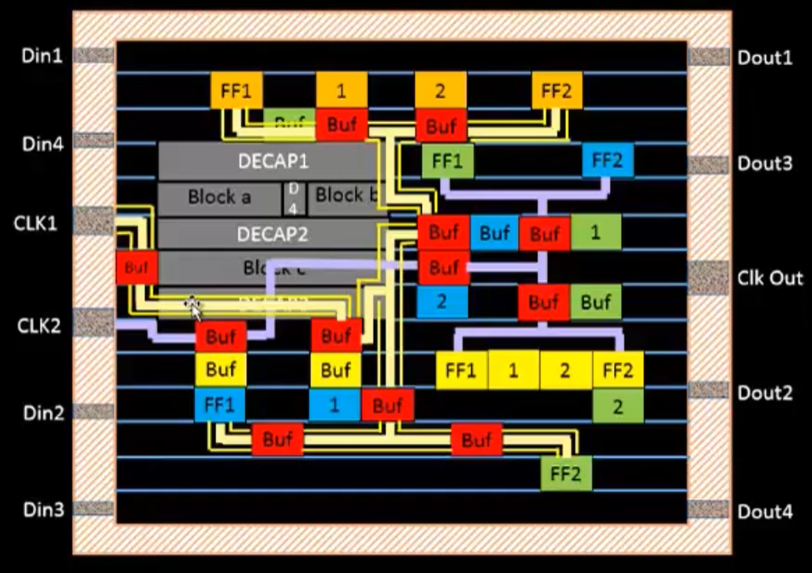

# Clock tree synthesis TritonCTS and signal integrity

  

  

- So we go for `H-Tree` method

  

  

- After adding buffers 👇

  

### Clock Net Shielding 👇

  

  

- therefore the clock net is shieled 

  

