# Timing analysis with real clocks

### Setup time Analysis

<p align="center">
  
</p>
<p align="center">
  
</p>
<p align="center">
  
</p>

### Hold time Analysis

<p align="center">
  
</p>
<p align="center">
  
</p>

<p align="center">
  
</p>

<p align="center">
  
</p>
<p align="center">
  
</p>

### LAB - Steps to analyze timing with real clocks

- run the cts using command `run_cts` we observe output like 👇
<p align="center">
  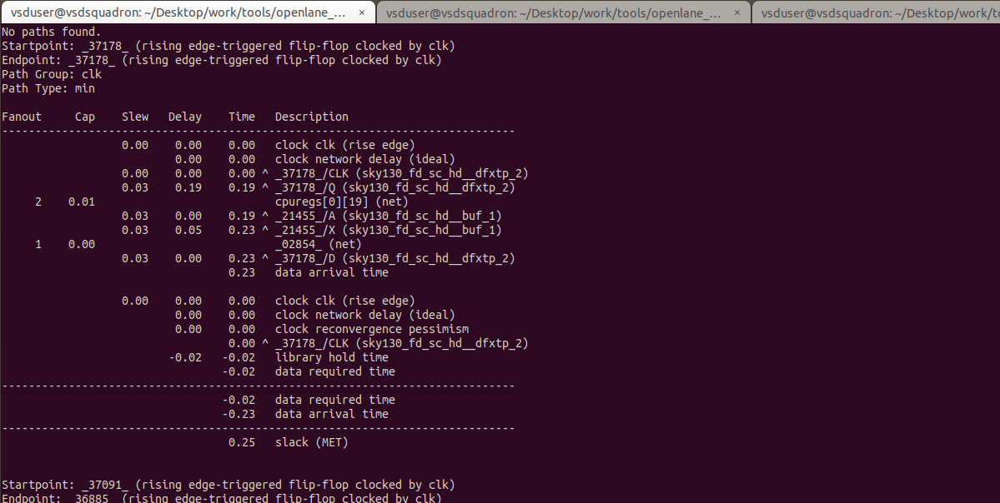
</p>
<p align="center">
  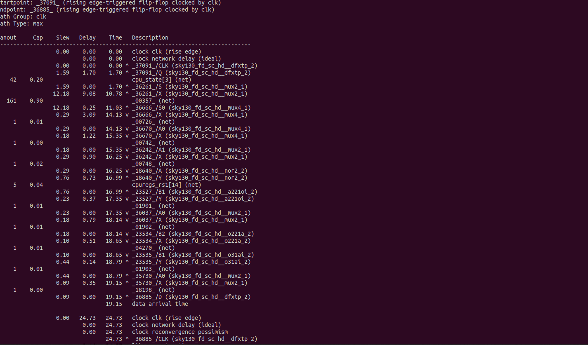
</p>
<p align="center">
  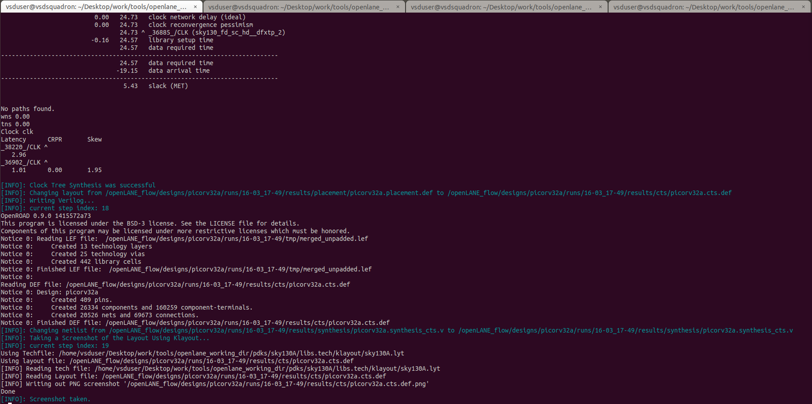
</p>

- Doing and Post-CTS OpenROAD timing analysis.
- for this we invoke `OpenROAD` in the `OpenFLOW` and execute the following commands
```shell
openroad
read_lef /openLANE_flow/designs/picorv32a/runs/16-03_17-49/tmp/merged.lef
read_def /openLANE_flow/designs/picorv32a/runs/16-03_17-49/results/cts/picorv32a.cts.def
write_db pico_cts.db
read_db pico_cts.db
read_verilog /openLANE_flow/designs/picorv32a/runs/16-03_17-49/results/synthesis/picorv32a.synthesis_cts.v
read_liberty $::env(LIB_TYPICAL)
link_design picorv32a
read_sdc /openLANE_flow/designs/picorv32a/src/my_base.sdc
set_propagated_clock [all_clocks]
report_checks -path_delay min_max -format full_clock_expanded -digits 4
```
<p align="center">
  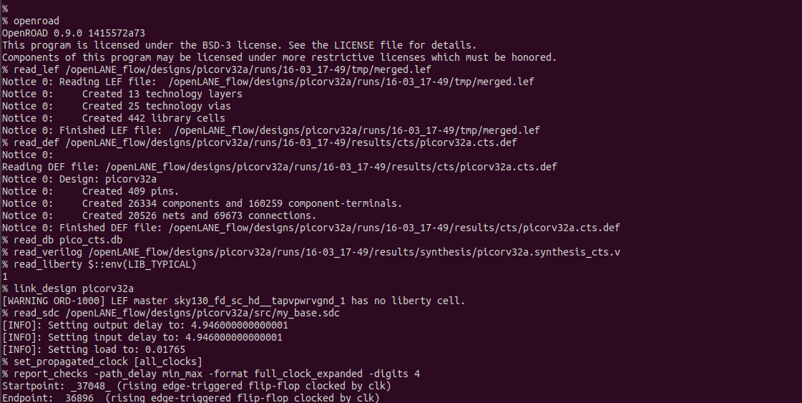
</p>
<p align="center">
  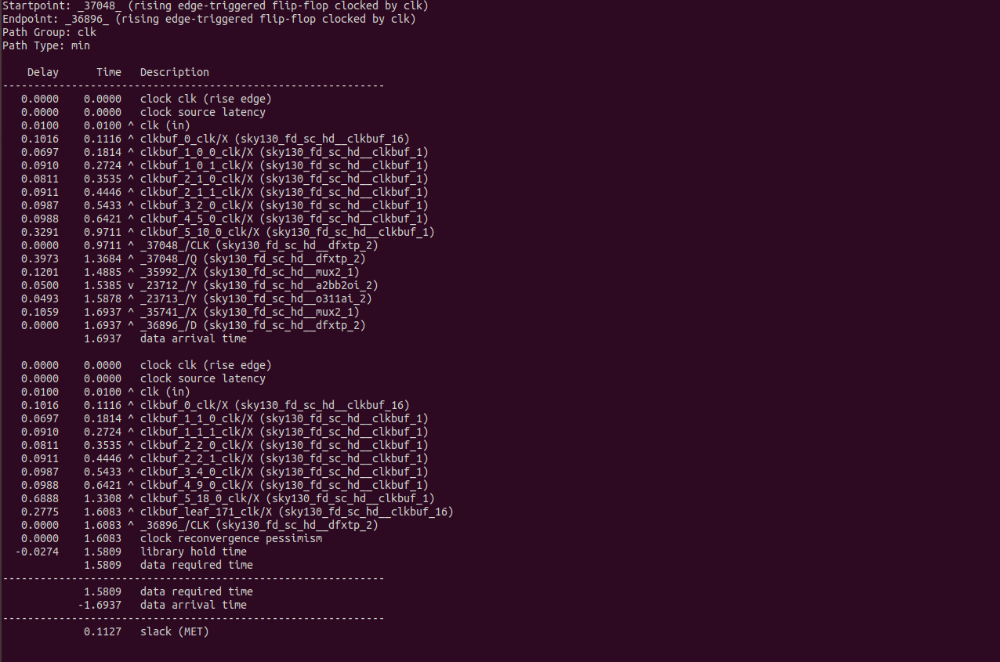
</p>
<p align="center">
  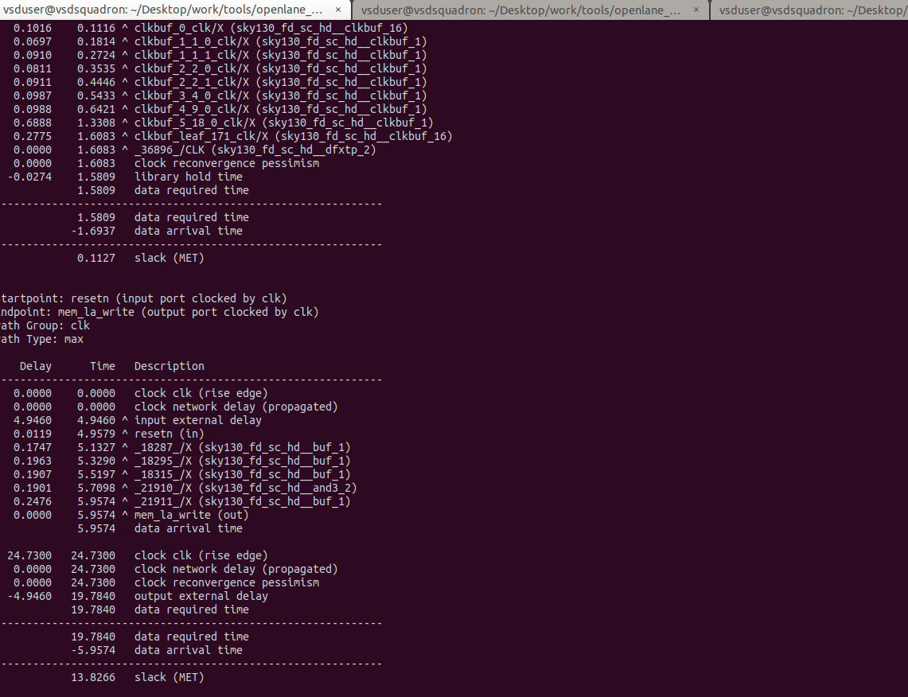
</p>


### Lab steps to observe impact of bigger CTS buffers on setup and hold timing


```shell
echo $::env(CTS_CLK_BUFFER_LIST)
set ::env(CTS_CLK_BUFFER_LIST) [lreplace $::env(CTS_CLK_BUFFER_LIST) 0 0]

echo $::env(CURRENT_DEF)
set ::env(CURRENT_DEF) /openLANE_flow/designs/picorv32a/runs/16-03_17-49/results/placement/picorv32a.placement.def

run_cts
echo $::env(CTS_CLK_BUFFER_LIST)

openroad

read_lef /openLANE_flow/designs/picorv32a/runs/16-03_17-49/tmp/merged.lef
read_def /openLANE_flow/designs/picorv32a/runs/16-03_17-49/results/cts/picorv32a.cts.def
write_db pico_cts1.db
read_db pico_cts1.db
read_verilog /openLANE_flow/designs/picorv32a/runs/16-03_17-49/results/synthesis/picorv32a.synthesis_cts.v
read_liberty $::env(LIB_TYPICAL)
link_design picorv32a
read_sdc /openLANE_flow/designs/picorv32a/src/my_base.sdc
set_propagated_clock [all_clocks]
report_checks -path_delay min_max -fields {slew trans net cap input_pins} -format full_clock_expanded -digits 4

report_clock_skew -hold
report_clock_skew -setup
```


<p align="center">
  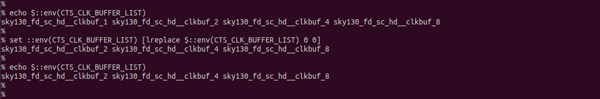
</p>
<p align="center">
  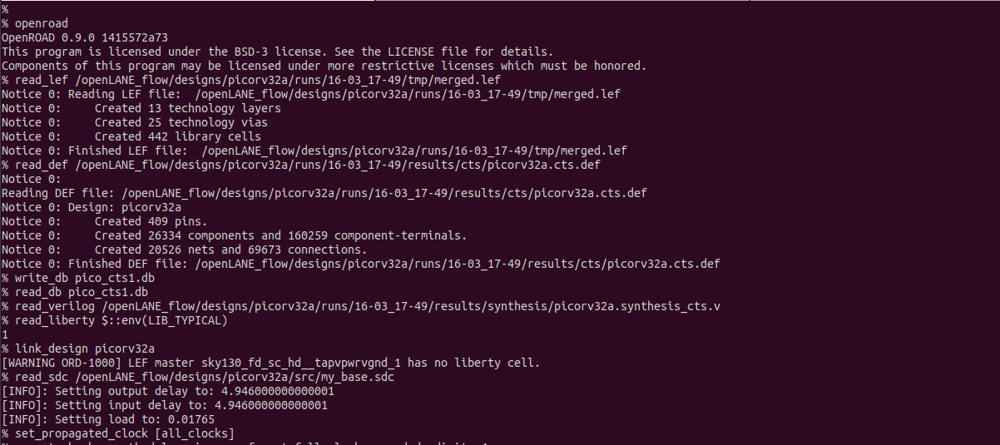
</p>
<p align="center">
  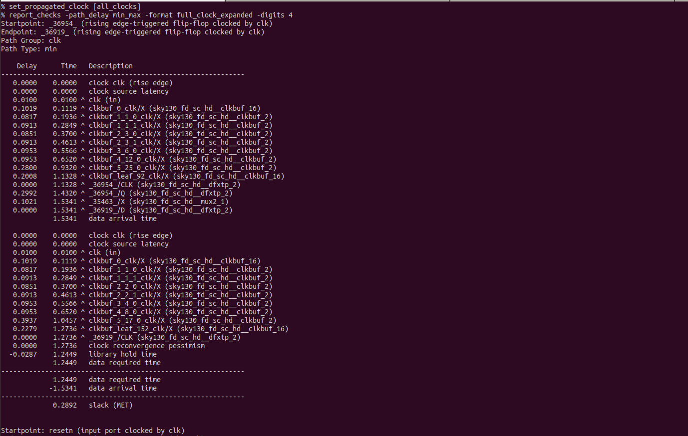
</p>
<p align="center">
  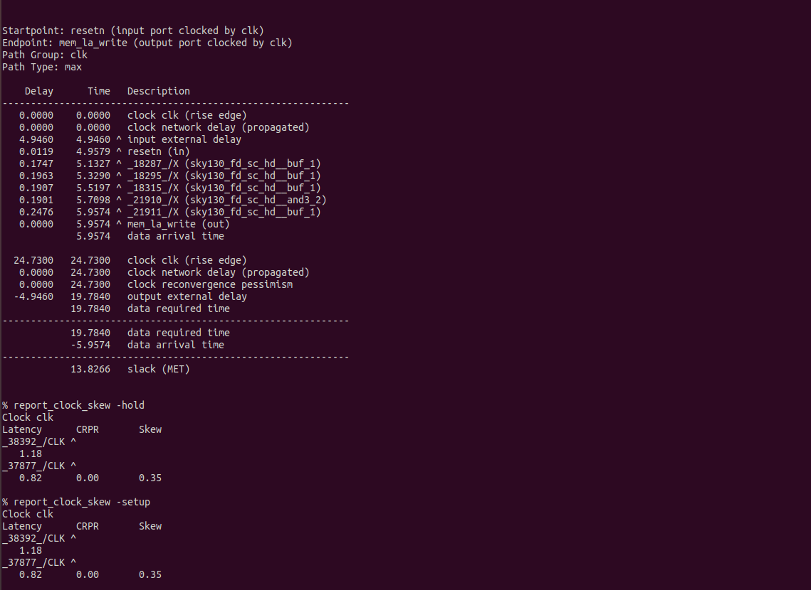
</p>

```
echo $::env(CTS_CLK_BUFFER_LIST)
set ::env(CTS_CLK_BUFFER_LIST) [linsert $::env(CTS_CLK_BUFFER_LIST) 0 sky130_fd_sc_hd__clkbuf_1]
```
<p align="center">
  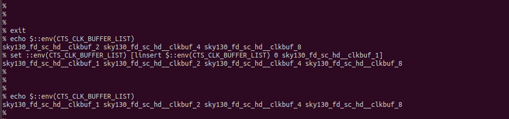
</p>


```shell
For clkbuf_1
    hold slack -   0.1127   slack (MET)
    setup slack -  13.8266   slack (MET)

For clkbuf_2
    hold slack -   0.2892   slack (MET)
    setup slack -  13.8266   slack (MET)
```
- The hold slack has been increased when `buf_2` is used
