# Power Distribution Network and routing

- to get generate power distribution network. complete until the cts will the follwoing commands 

```shell
prep -design picorv32a -tag 20-03_18-30 -overwrite
set lefs [glob $::env(DESIGN_DIR)/src/*.lef]
add_lefs -src $lefs

set ::env(SYNTH_STRATEGY) "DELAY 0"
set ::env(SYNTH_SIZING) 1

run_synthesis

init_floorplan
place_io
global_placement_or
detailed_placement
tap_decap_or
detailed_placement

run_cts
```
- use the command `gen_pdn` to generate the power distribution network
  
<p align="center">
  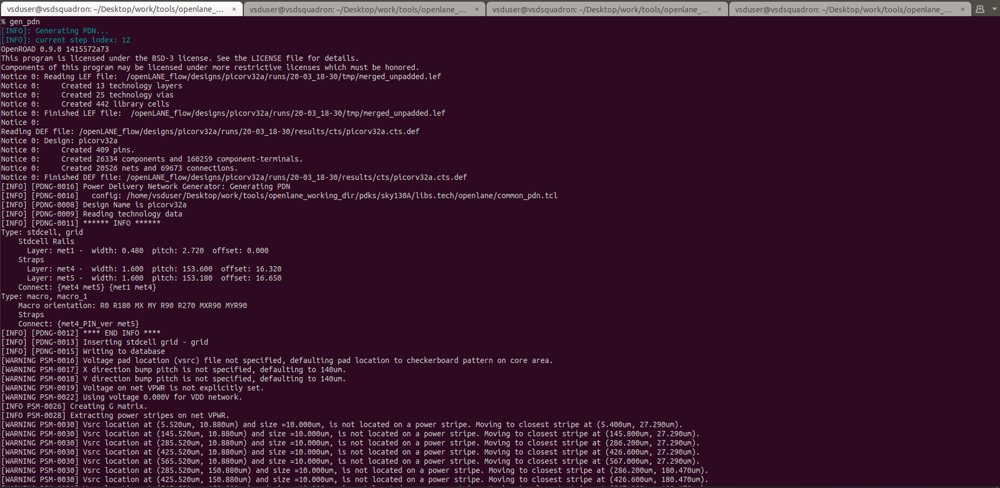
</p>
<p align="center">
  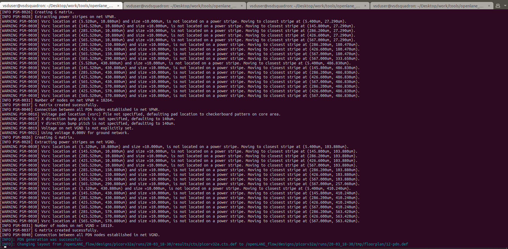
</p>

- to view the pdn output naviagte to the directory `openlane_working_dir/openlane/designs/picorv32a/runs/20-03_18-30/tmp/floorplan/` in here we have `12-pdn.def` file
- `def` files can viewed in magic. command is 👇

```shell
magic -T /home/vsduser/Desktop/work/tools/openlane_working_dir/pdks/sky130A/libs.tech/magic/sky130A.tech lef read ../../tmp/merged.lef def read 12-pdn.def &
```

<p align="center">
  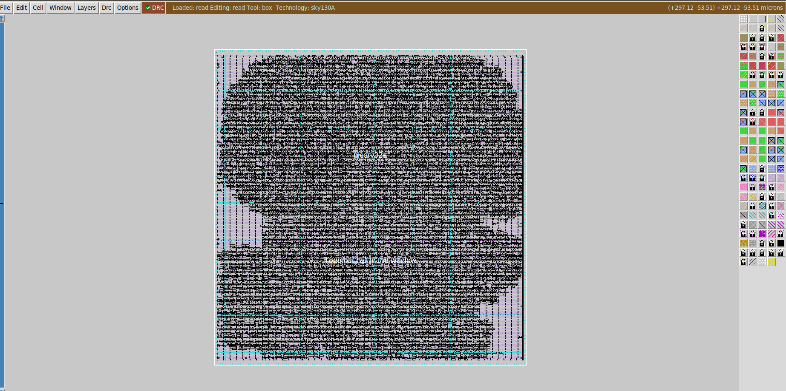
</p>
<p align="center">
  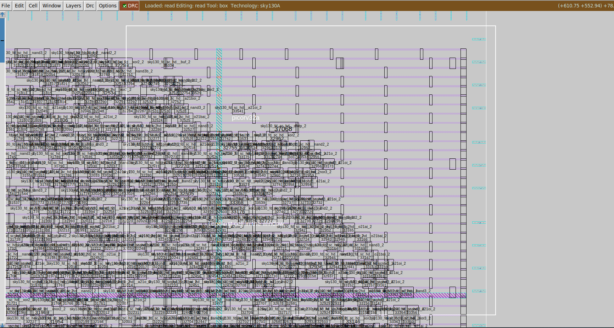
</p>
<p align="center">
  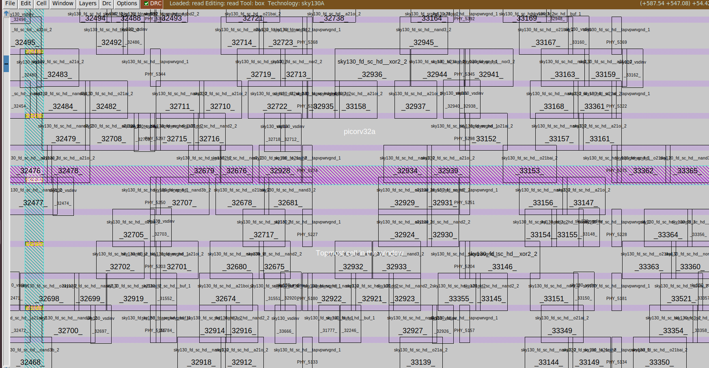
</p>


### the next step, which is left is routing..

- use the command `run_routing` to perform routing.

<p align="center">
  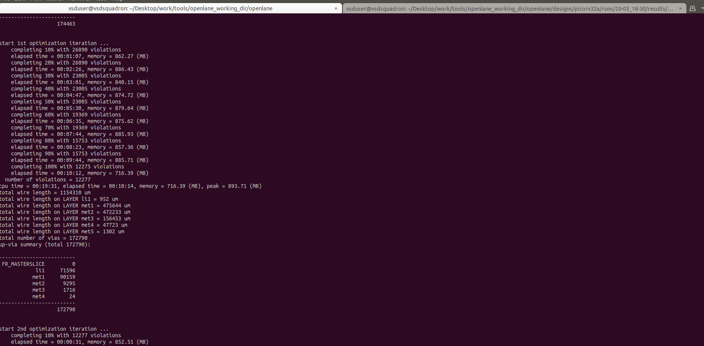
</p>
<p align="center">
  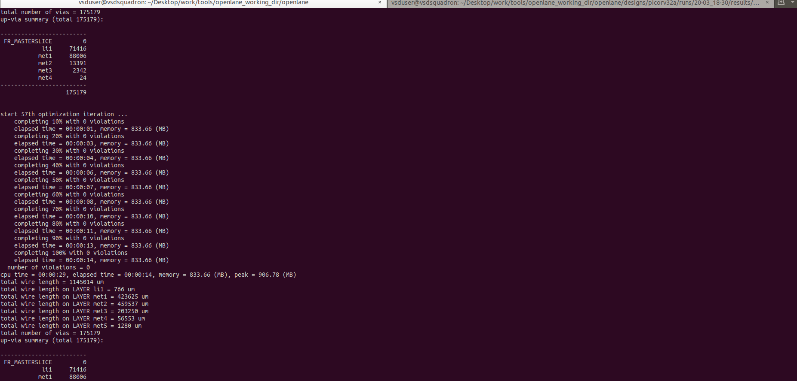
</p>
<p align="center">
  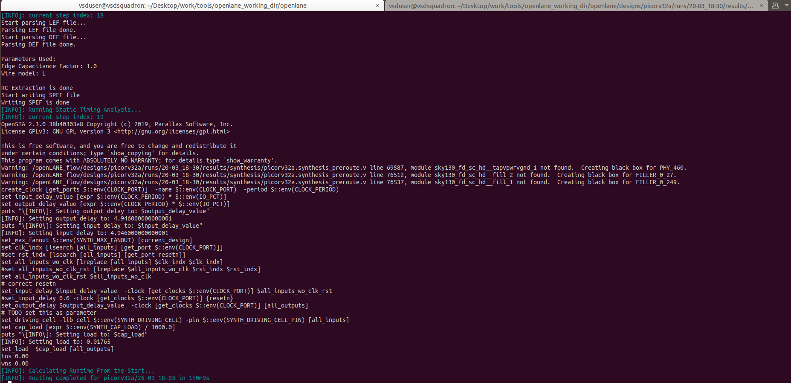
</p>

- It took me around 1 hour for complete routing
- Routing started with `26890` violations in the `1st optimization` iteration and finally reduced to `0` violations in the `57th optimization` iteration

- to open routing file naviagte to directory `cd Desktop/work/tools/openlane_working_dir/openlane/designs/picorv32a/runs/20-03_18-30/results/routing/` there we have def which is read magic
```
magic -T /home/vsduser/Desktop/work/tools/openlane_working_dir/pdks/sky130A/libs.tech/magic/sky130A.tech lef read ../../tmp/merged.lef def read picorv32a.def &
```
<p align="center">
  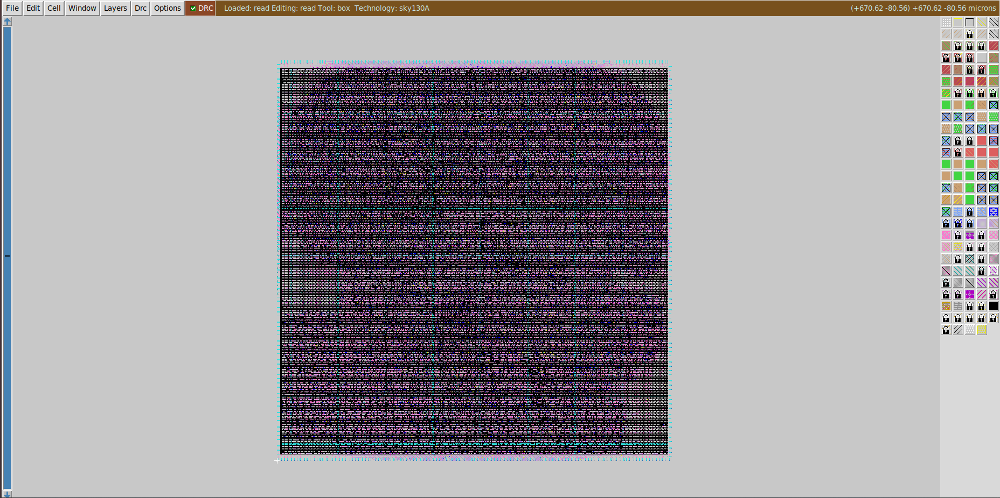
</p>
<p align="center">
  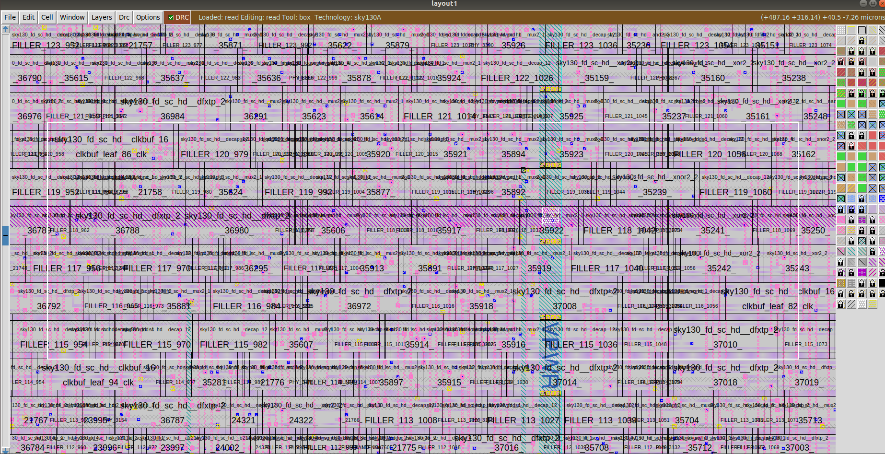
</p>
<p align="center">
  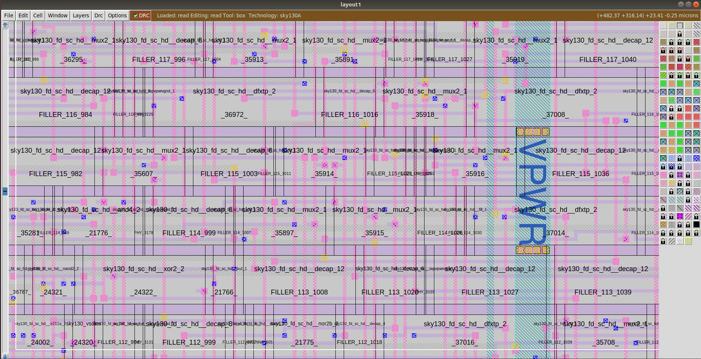
</p>

- The `picorv32a.def.png` from the routing is 👇 
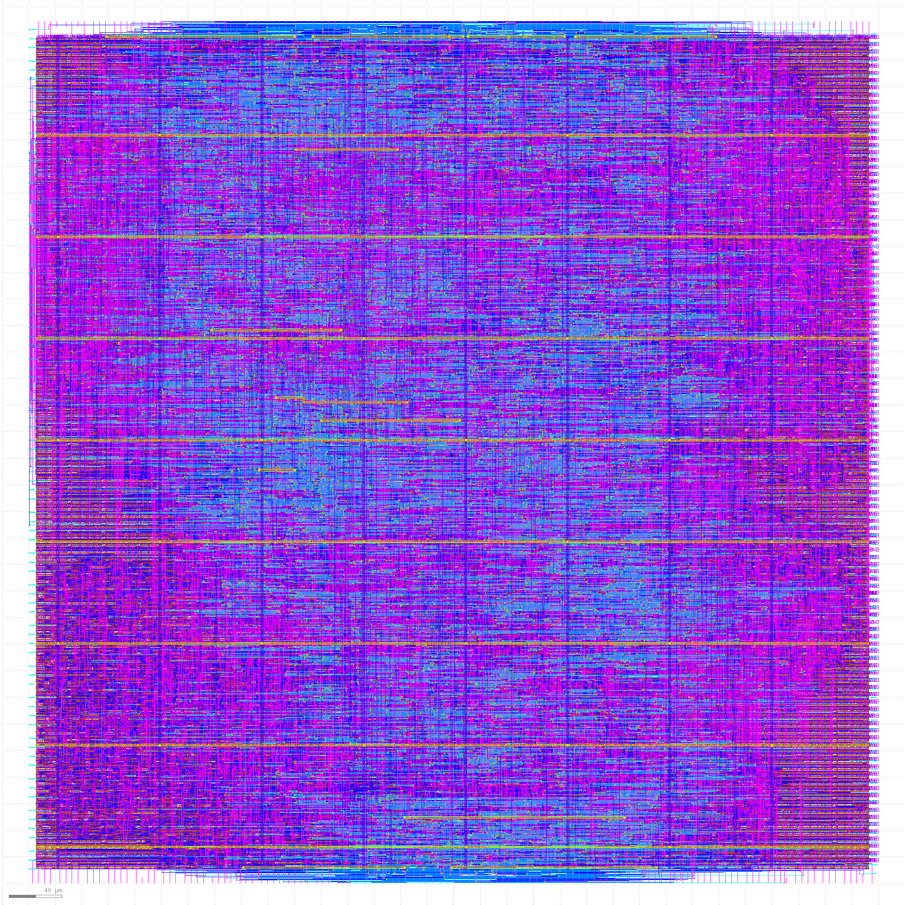

